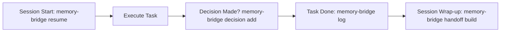

# Memory Bridge Skill

Use this skill whenever working in a project that uses `engrene-memory-bridge` (indicated by the presence of a `.memory-bridge/` folder or when the user asks to track project memory).

`memory-bridge` ensures continuous context across different AI tools (Antigravity, Claude, Codex, Gemini, Aider, Cursor, Copilot) without vendor lock-in.

---

## Quick Reference Workflow



---

## 1. At Session Start (Before Starting Tasks)

Always inspect the current project state before starting any new task:

```bash
# Get the current objective, pending tasks, recent decisions and warnings:
memory-bridge resume --for antigravity
```

If the project does not have memory initialized yet, initialize it:
```bash
memory-bridge init
```

You can also read `.memory-bridge/handoff.md` and `.memory-bridge/project-context.md` directly.

---

## 2. When Making Architectural or Technical Decisions

Whenever a non-trivial choice is made (choosing an engine, altering data format, adding a dependency, refactoring architecture):

```bash
memory-bridge decision add \
  --title "Short decision title" \
  --decision "What was decided and chosen" \
  --context "Why this was needed and alternatives considered" \
  --impact "Effects on the codebase and downstream components"
```

---

## 3. After Completing a Task or Significant Action

Record the session event so future sessions and other tools know what happened:

```bash
memory-bridge log \
  --tool antigravity \
  --intent "User intent or task description" \
  --summary "Concise summary of actions performed and changes made" \
  --actions "task 1,task 2" \
  --artifacts "file1.ts,file2.md" \
  --tags "feature,ui"
```

> **Note**: Sensitive secrets (API keys, tokens, private keys) are automatically redacted by the engine.

---

## 4. Searching Project Memory

To recall past context, previous sessions, or architectural reasons:

```bash
# Hybrid search (combines BM25 keywords + semantic vectors):
memory-bridge search "why did we choose sqlite" --mode hybrid

# Text search:
memory-bridge search "docker compose" --mode text
```

---

## 5. Before Ending the Session or Switching Tools

Always rebuild the handoff file so the next AI agent or human teammate starts with up-to-date context:

```bash
memory-bridge handoff build
```

---

## 6. Maintenance & Health Checks

```bash
# Check memory file integrity, syntax, and leak risks:
memory-bridge lint

# Deduplicate superseded decisions and clean up handoff:
memory-bridge consolidate

# Inspect overall health:
memory-bridge doctor
```
