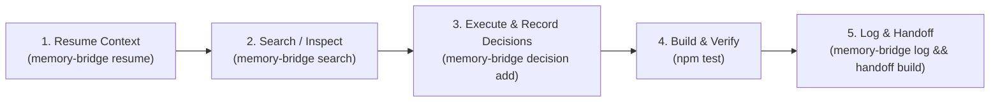

# AGENTS.md — Universal AI Agent Guidelines (Compound Engineering)

Welcome, AI Agent! This project uses **Memory Bridge** (`engrene-memory-bridge`) alongside **Compound Engineering (CE)** principles to maintain seamless context, project standards, and historical learnings across all AI tools.

---

## 🧭 Memory Bridge Lifecycle Protocol (Mandatory)

Whenever operating in this repository, follow this execution lifecycle:



### 1. Session Start
Before making any changes, inspect active context:
```bash
memory-bridge resume --for <agent-name>
```

### 2. Decision Recording
When making non-trivial architectural choices or adding dependencies:
```bash
memory-bridge decision add --title "Title" --decision "Choice" --context "Rationale" --impact "Effects"
```

### 3. Verification & Handoff
Before wrapping up your turn:
```bash
npm run build && npm test
memory-bridge log --tool <agent-name> --intent "Summary" --summary "Details"
memory-bridge handoff build
```

---

## 📌 Project Invariants & Context
# Project Context

## Current Objective
Describe the current milestone and expected outcome.

## Constraints
- Local-first only
- Keep memory portable between tools

## Notes
Add stable context that should persist across sessions.


---

## 🏛️ Active Architectural Decisions & Project Pitfalls
- **[dec-mu7tvkhc] Independent Community Memory Bridge**: Adopt filesystem JSONL and Markdown contracts under .memory-bridge with zero runtime dependencies *(Impact: Full transparency, no vendor lock-in, cross-tool continuity between Claude, Codex, Gemini, Antigravity and Orca)*
- **[dec-mu7tvkjh] Hybrid Local Search Engine**: Combine BM25 term weighting with local embedded SQLite cosine similarity *(Impact: Fast, local, offline search without cloud LLM API dependencies)*
- **[dec-muc3rsh5] Obsidian Vault Export & JEV BM25 Hybrid Provider Support**: Added optional Obsidian vault sync (memory-bridge obsidian --vault <path>) exporting Markdown notes with YAML frontmatter and wikilinks, and added 'jev' semantic provider option for joint code-text search combined with BM25 SQLite FTS5. *(Impact: Expands memory-bridge export capabilities to Obsidian and improves semantic vector retrieval options.)*
- **[dec-mucoine1] Compound Engineering (CE) Multi-Agent Rules Synchronization**: Added 'memory-bridge ce' CLI command and core module (src/core/ce.ts) to automatically generate and sync AGENTS.md, .cursorrules, CLAUDE.md, and copilot-instructions.md with active decisions and pitfalls. *(Impact: Ensures all AI assistants automatically inherit project decisions, memory lifecycle protocols, and pitfalls without manual prompt editing.)*
- **[dec-mucplvwt] Automatic Multi-Agent & Obsidian Sync Triggers**: Added automatic integration execution (src/core/auto-sync.ts) triggered on 'decision add', 'log', and 'handoff build' events to keep Compound Engineering files and Obsidian vaults in sync automatically. *(Impact: Eliminates manual sync steps and keeps rule files and Obsidian notes updated in real-time.)*
