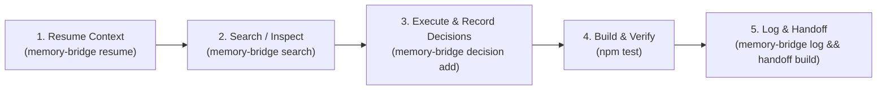

# AGENTS.md — Universal AI Agent Guidelines

Welcome, AI Agent! This repository implements **Memory Bridge** (`engrene-memory-bridge`), a local-first, portable memory protocol designed to maintain seamless context across all AI tools (Antigravity, Claude Code, Codex, Gemini, Cursor, Windsurf, Aider, GitHub Copilot, etc.) without vendor lock-in.

Whenever you operate in this repository, follow the protocols defined below.

---

## 🧭 Native Skills Available

This repository provides ready-to-use skills:

* **Memory Bridge Skill**:
  * Root path: [skills/memory-bridge/SKILL.md](skills/memory-bridge/SKILL.md)
  * Agent standard path: [.agents/skills/memory-bridge/SKILL.md](.agents/skills/memory-bridge/SKILL.md)

If your environment supports native skills (e.g. Antigravity, Claude Code, Codex, etc.), read and activate the skill before starting work.

---

## ⚡ Agent Lifecycle Protocol (Mandatory)



### 1. Session Start (Resume Context)

Before taking any action or planning code changes, always inspect the project memory:

```bash
# Run CLI resume command (replace <agent-name> with your agent identifier):
memory-bridge resume --for <agent-name>
```

If running outside the CLI or in read-only environment:
* Read [.memory-bridge/handoff.md](.memory-bridge/handoff.md)
* Read [.memory-bridge/project-context.md](.memory-bridge/project-context.md)

### 2. Searching Past Context & Decisions

If you need context on why a feature was implemented or past decisions:

```bash
# Hybrid search (combines BM25 keywords + semantic embeddings):
memory-bridge search "<query>" --mode hybrid

# Text search:
memory-bridge search "<query>" --mode text
```

### 3. Recording Architectural or Technical Decisions

Whenever you make non-trivial architectural or technical choices (e.g., adding dependencies, changing formats, refactoring core engines):

```bash
memory-bridge decision add \
  --title "Short decision title" \
  --decision "What was decided and chosen" \
  --context "Why this was needed and alternatives considered" \
  --impact "Effects on codebase and downstream components"
```

### 4. Build, Test & Lint

Always ensure tests and lint pass before wrapping up your task:

```bash
# Compile and build:
npm run build

# Run unit and integration tests:
npm test

# Verify memory integrity and check for secret leaks:
memory-bridge lint
```

### 5. Session Wrap-Up & Handoff (Critical)

Never finish your turn without persisting your work to memory and generating the handoff:

```bash
# 1. Log your session event:
memory-bridge log \
  --tool <agent-name> \
  --intent "Summary of user request" \
  --summary "Concise description of changes made and results" \
  --actions "task 1,task 2" \
  --artifacts "file1.ts,file2.md" \
  --tags "feature,fix,docs"

# 2. Rebuild handoff for the next AI or developer:
memory-bridge handoff build
```

---

## 🛠️ Repository Quick Reference

| Command | Purpose |
|---|---|
| `npm run build` | Clean, compile TypeScript, copy UI assets, set permissions |
| `npm test` | Run full test suite (unit + integration tests) |
| `npm run clean` | Remove `dist/` directory |
| `memory-bridge resume --for <tool>` | Print current objective, pending tasks, recent decisions |
| `memory-bridge ui` | Open visual local dashboard in browser |
| `memory-bridge doctor` | Verify system health, file permissions, and redaction |
| `memory-bridge lint` | Check JSONL syntax and scan for accidental secrets |
| `memory-bridge consolidate` | Deduplicate decisions and refresh handoff |

---

## 🔒 Rules & Constraints

1. **Local-First Only**: Never send project code or memory data to external cloud memory APIs. All state is stored locally under `.memory-bridge/`.
2. **Zero Runtime Dependencies**: The core memory engine uses pure Node.js stdlib and zero third-party dependencies at runtime. Keep it lean and secure.
3. **Secret Redaction**: Sensitive patterns (API keys, GitHub tokens, passwords) are automatically redacted, but agents must never log real credentials.
4. **Git Hygiene**: Do not commit `.memory-bridge/sessions/` or private logs (handled by `.gitignore`).
5. **Zero Background Daemons**: Memory Bridge is completely stateless and file-driven. Never attempt to launch or require background daemons or port 8787 (which is only an optional web UI for humans) to save memory; CLI commands or direct filesystem reads/writes are instant and complete.
