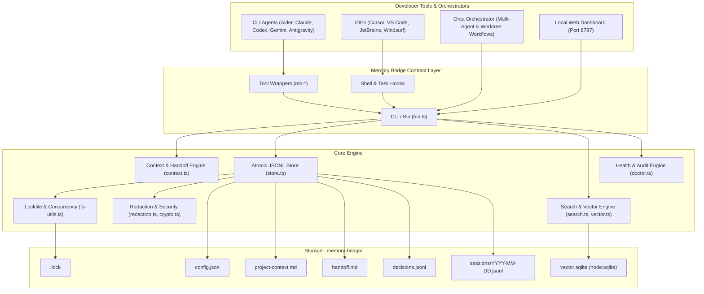
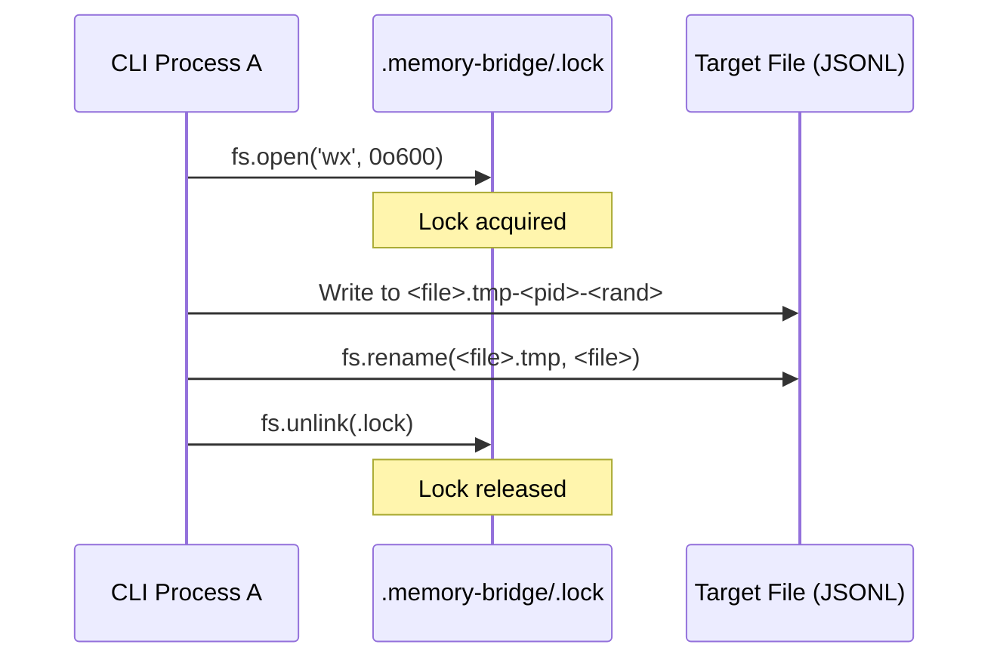
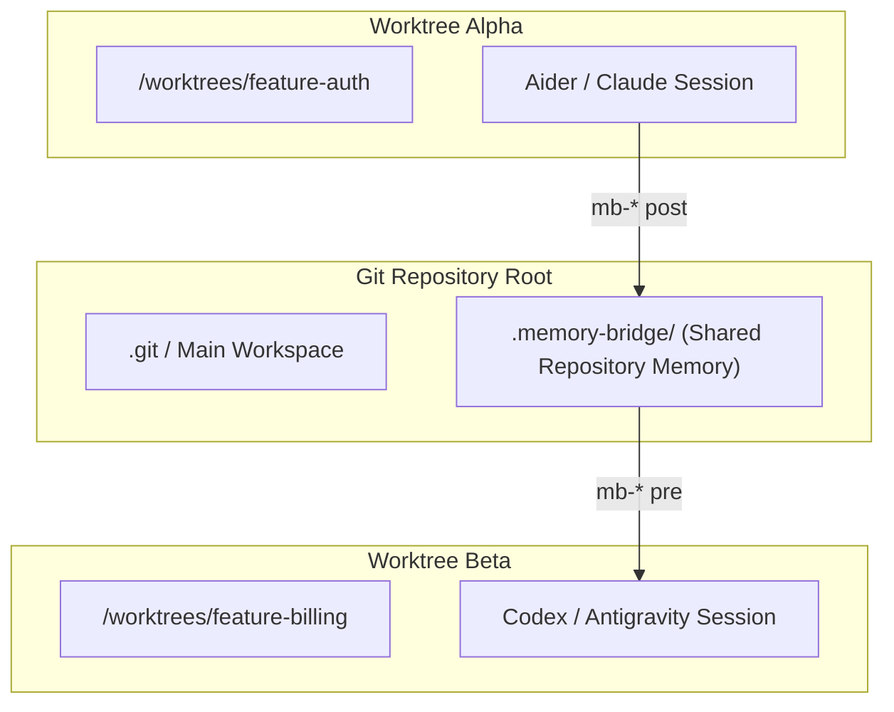

# Architecture: engrene-memory-bridge

`engrene-memory-bridge` is a local-first, zero-runtime-dependency memory layer designed for AI coding assistants, CLIs, and multi-agent orchestrators like Orca. It acts as an open, community-driven, independent alternative to proprietary or MCP-locked memory services by treating the local filesystem and repository contract as the primary source of truth.

---

## 1. Architectural Philosophy

1. **Local-First & Repository-Native**: All memory lives inside `.memory-bridge/` in human-readable (Markdown) and structured append-only (JSONL) formats.
2. **Zero Runtime Dependencies**: The core runtime relies exclusively on Node.js 20+ built-ins (`node:fs`, `node:crypto`, `node:sqlite`, `node:http`, `node:child_process`).
3. **Contract-First Interoperability**: Tools interact through a uniform Pre/Post contract (`resume` -> work -> `log` -> `handoff build`), eliminating runtime vendor coupling.
4. **Crash-Resilient & Non-Blocking**: Operations gracefully degrade. If history is missing or partially corrupted, the system returns fallback snapshots with actionable warnings instead of throwing fatal errors.
5. **Strict Data Privacy**: Automatic client-side secret redaction and optional AES-256-GCM envelope encryption prevent credentials from leaking into repository memory.

---

## 2. System Overview & Component Diagram



---

## 3. Storage Layout & Data Contracts

All memory artifacts are stored in `<workspace>/.memory-bridge/`:

```
.memory-bridge/
├── config.json               # Local configuration (redaction, encryption, semantic settings)
├── project-context.md        # Static project invariants, architecture rules, and current objectives
├── handoff.md                # Consolidated snapshot of pending tasks, next steps, and recent artifacts
├── decisions.jsonl           # Append-only architectural and technical decisions
├── sessions/
│   └── YYYY-MM-DD.jsonl      # Daily append-only operational session logs
├── vector.sqlite             # Local SQLite database for semantic vector embeddings (node:sqlite)
└── .lock                     # Inter-process mutex lockfile
```

### 3.1 Event Schemas

#### Session Event (`session_event`)
Persisted to `sessions/YYYY-MM-DD.jsonl`:
```typescript
interface SessionEvent {
  ts: string;          // ISO-8601 UTC timestamp
  tool: string;        // Name of the CLI/tool (e.g., "claude", "aider", "orca")
  workspace: string;   // Normalized absolute workspace path
  branch: string;      // Current git branch name
  intent: string;      // Primary objective or prompt intent
  actions: string[];   // Specific tasks, next items, or TODOs
  artifacts: string[]; // Files created, modified, or referenced
  summary: string;     // Brief outcome summary
  tags: string[];      // Categorization tags (e.g., ["auth", "refactor"])
}
```

#### Decision Event (`decision_event`)
Persisted to `decisions.jsonl`:
```typescript
interface DecisionEvent {
  id: string;          // Unique decision identifier (e.g., "dec-m6k91a")
  ts: string;          // ISO-8601 UTC timestamp
  title: string;       // Concise title of the technical decision
  context: string;     // Problem statement, constraints, or alternatives considered
  decision: string;    // The chosen approach or architecture rule
  impact: string;      // Expected downstream consequences or affected subsystems
  supersedes: string[];// List of decision IDs superseded by this record
}
```

#### Handoff Document (`handoff.md`)
Generated deterministically via `memory-bridge handoff build`:
- **Objective**: Latest session intent or fallback from `project-context.md`.
- **Recent Decisions**: Last 5 active decisions formatted as bullet points.
- **Pending Tasks**: Deduped list of TODOs and uncompleted actions extracted from recent sessions and existing handoff.
- **Next Steps**: Explicit immediate actions for the next tool or developer.
- **Recent Artifacts**: Files touched across recent sessions.

---

## 4. Concurrency, Atomicity & Lock Protocol

To prevent JSONL corruption when multiple CLI agents, background tasks, or subagents write simultaneously:

1. **Lockfile (`.lock`)**: Cross-process mutual exclusion via atomic file creation (`fs.open(lockPath, 'wx')`).
2. **Backoff & Jitter**: If locked, processes wait with randomized jitter (30–70ms) up to a configurable timeout (default: 15,000ms).
3. **Atomic Replace**: All writes write to a unique temporary file (`<path>.tmp-<pid>-<time>-<rand>`) and atomically replace the destination via `fs.rename()`.
4. **Strict Permissions**: Folders are secured with `0o700` and files with `0o600`.



---

## 5. Security & Privacy Layer

1. **In-Flight Redaction**:
   - Executes automatically prior to persistence across all strings, nested objects, and arrays.
   - Redacts private key blocks, OpenAI-style keys (`sk-...`), AWS access keys (`AKIA...`), HTTP Bearer tokens, key/token assignment statements (`api_key=...`), and sensitive `.env` lines.
2. **Optional Envelope Encryption**:
   - AES-256-GCM cipher with initialization vector (IV) and authentication tag.
   - Enabled via `memory-bridge init --encryption` with secret supplied through environment variable `MEMORY_BRIDGE_KEY`.
3. **Doctor Verification (`memory-bridge doctor`)**:
   - Scans stored memory files for leakage patterns and verifies filesystem permissions.

---

## 6. Search & Semantic Vector Engine

- **Text Search (Default)**: In-memory substring scoring across sessions, decisions, handoff, and project context.
- **Semantic Search (Optional)**:
  - Powered by embedded `node:sqlite` (Node.js 20+ built-in `DatabaseSync`).
  - Generates token vectors via SHA-256 feature hashing across configurable dimensions (default: 64).
  - Performs cosine similarity ranking locally without third-party models or cloud API calls.

---

## 7. Orca & Multi-Worktree Topology

Orca workflows operate across multiple workspaces, task trees, and Git worktrees. To support Orca as an independent memory bridge:



### Key Worktree Integration Principles:
1. **Repository Root Discovery**: Climb parent directories to detect the primary `.git` root or common `.memory-bridge/` configuration.
2. **Worktree-Aware Branch Tagging**: Automatically capture branch and worktree path in every `session_event`.
3. **Cross-Worktree Resume**: Allow agents working on branch `feature-b` to consume decisions and handoffs generated in `feature-a`.
4. **Non-Conflicting Locking**: Use repository-level or workspace-scoped lockfiles to avoid deadlocks across sibling worktrees.
