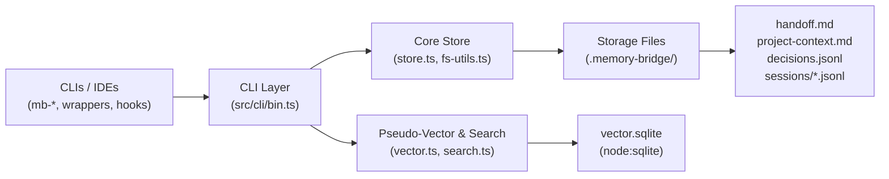
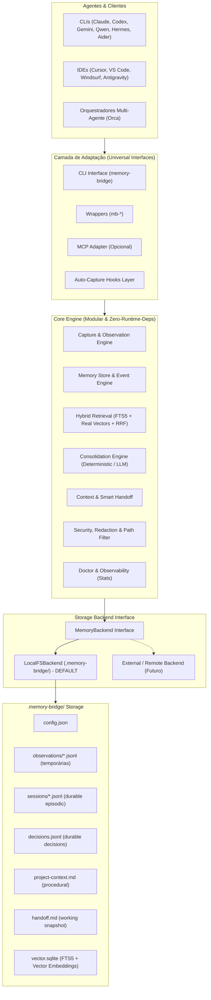

# Análise Arquitetural: engrene-memory-bridge vs. ai-memory
**Evolução para Camada Universal de Memória Inteligente (Universal Memory Adapter)**

---

## 1. Visão Geral e Contexto

O **`engrene-memory-bridge`** nasceu com a missão de fornecer continuidade de contexto entre diferentes agentes e CLIs de IA (Claude Code, Cursor, Codex, Gemini, Antigravity, Aider, etc.) usando um contrato simples, transparente, sem daemons obrigatórios e baseado em arquivos texto puro (`.memory-bridge/`).

O projeto de referência conceitual, **`akitaonrails/ai-memory`** (criado por Fabio Akita em Rust), consolidou no ecossistema ideias avançadas como:
- Captura de observações de sessão (*raw observations*).
- Consolidação periódica inspirada na arquitetura Hermes / Karpathy Wiki.
- Busca híbrida com SQLite FTS5 e embeddings de vetor.
- Separação de tipos de memória (episódica, semântica, procedural, decisões).
- Suporte a MCP (Model Context Protocol).

O objetivo desta análise **não é transformar o Memory Bridge em um clone do `ai-memory`**, nem introduzir complexidade desnecessária ou abandonar a biblioteca padrão do Node.js. O objetivo é **evoluir o Memory Bridge de um sistema estritamente pre/post (`resume → trabalhar → log → handoff`) para um ciclo inteligente de ciclo de vida (`capturar → indexar → consolidar → recuperar → gerar handoff`)**, mantendo a simplicidade, portabilidade e filosofia local-first que tornam o projeto único.

---

## 2. Diagnóstico da Arquitetura Atual

### 2.1 Componentes Atuais

### 2.2 Pontos Fortes
1. **Zero Runtime Dependencies**: Roda em Node.js >= 20 com zero `node_modules` de produção, garantindo segurança estrita e portabilidade imediata.
2. **Zero Daemons / Zero Overhead**: Completamente stateless. Executa em milissegundos, escreve no disco e encerra o processo.
3. **Contratos Humanos Legíveis**: Markdown (`.md`) para síntese imediata e JSON Lines (`.jsonl`) append-only para histórico auditável via `git diff`.
4. **Resiliência a Falhas e Concorrência**: Bloqueio inter-processo via lockfile (`.lock`), escritas atômicas com `atomicWriteFile`, e degradação elegante com avisos em vez de falhas fatais.
5. **Segurança Proativa**: Motor de redação ativa (`redaction.ts`) cobrindo segredos de múltiplos provedores e criptografia de envelope AES-256-GCM opcional.
6. **Interface Gráfica Integrada**: Dashboard visual sob demanda (`memory-bridge ui` na porta 8787) com internacionalização (PT-BR, EN, ES) e tema claro/escuro.

### 2.3 Limitações Identificadas
1. **Busca Semântica Falsa (Token Hashing)**: O `vector.ts` atual divide o texto em tokens, aplica SHA-256 e projeta em 192 dimensões. Isso é apenas um hash esparso — **não captura sinonímia nem proximidade semântica real** (ex: "problema de login" não encontra "falha de autenticação").
2. **Busca Textual em Memória Sem FTS**: A busca textual atual carrega até 300 sessões e 200 decisões para a memória RAM a cada busca e calcula BM25 via loops JavaScript. Conforme o histórico cresce, isso não escala tão bem quanto um índice FTS5 indexado no SQLite.
3. **Dependência Excessiva de Intervenção Manual**: O sistema exige que o desenvolvedor ou o wrapper passe flags explícitas (`--intent`, `--summary`, `--actions`, `--artifacts`). Se uma sessão terminar abruptamente sem o comando `log`, o contexto é perdido.
4. **Falta de Camada de Observação Bruta (Observations)**: Não há buffer transitório para capturar passos intermediários de ferramentas (`tool_call`, `tool_result`, `user_prompt`).
5. **Tipagem de Memória Plana**: Sessões, decisões e handoff não distinguem conceitualmente conhecimento procedural (regras duráveis), fatos semânticos do projeto e registros de trabalho em andamento (*working memory*).
6. **Acoplamento Direto ao Filesystem Local**: O código atual acessa arquivos diretamente em caminhos fixos; não existe uma abstração de backend que permita plugar outros adaptadores sem reescrever `store.ts`.

### 2.4 Riscos e Dívida Técnica
- **Risco de Dependência Pesada em Embeddings**: Incorporar modelos de IA locais gigantes em Node.js pode inflar o pacote com binários nativos pesados ou exigir Python. Deve-se priorizar modelos extremamente leves e compatíveis com ONNX/WASM ou abstrair com providers (Local leve via WASM/ONNX, Ollama/OpenAI compatível ou desativado).
- **Risco de Poluição por Observações**: Se as ferramentas registrarem cada saída de terminal, a pasta `.memory-bridge` pode crescer gigabytes rapidamente. É vital implementar uma política rígida de retenção (`retentionDays` / `maxSessions`) e expurgo pós-consolidação.
- **Risco de Fragmentação de Contrato**: Adicionar novos campos não pode invalidar projetos já inicializados com o schema v1.0.0.

---

## 3. Comparativos Arquiteturais

### 3.1 `engrene-memory-bridge` vs. `akitaonrails/ai-memory`

| Dimensão | `akitaonrails/ai-memory` (Rust) | `engrene-memory-bridge` (Original) | `engrene-memory-bridge` (Universal Adapter) |
| :--- | :--- | :--- | :--- |
| **Linguagem & Runtime** | Rust (binário nativo compilado) | TypeScript / Node.js 20+ (zero deps) | TypeScript / Node.js 20+ (zero runtime deps no core) |
| **Arquitetura de Execução** | Daemon/servidor contínuo (MCP/HTTP) | Stateless CLI / Scripts instantâneos | Stateless CLI padrão + MCP adapter opcional |
| **Formato Primário** | Markdown Wiki (estilo Karpathy) + SQLite | JSONL append-only + Markdown handoff | JSONL + Markdown + SQLite (FTS5 + Vetores) |
| **Busca Textual** | SQLite FTS5 | BM25 em memória (JavaScript puro) | SQLite FTS5 integrado com suporte a BM25 |
| **Busca Semântica** | Embeddings locais / ONNX / Fastembed | SHA-256 token hashing (pseudo-vetores) | Embeddings densos (WASM/Cosine nativo ou Provider API opcional) |
| **Fusão de Ranking** | Heurística proprietária | Média normalizada (50% text + 50% vector) | Reciprocal Rank Fusion (RRF) com recência e tipo |
| **Captura de Sessão** | Observações automáticas via MCP/Hooks | Manual via flags `pre`/`post` | Híbrido: Manual (`log`) + Observações automáticas transitórias |
| **Consolidação** | Agente de melhoria contínua (Hermes-like) | Deduplicação básica de decisões | Consolidator dual: Determinístico (zero-LLM) ou LLM local/API |
| **Tipos de Memória** | Conceitual em páginas da Wiki | Sessões e Decisões | Metadados: `working`, `episodic`, `semantic`, `procedural`, `decision` |
| **Consumo de Context Window** | Alto (~20 schemas de MCP tools injetados) | Muito baixo (~30 linhas de handoff.md) | Muito baixo: handoff conciso cirúrgico mantido |
| **Sensibilidade a Segredos** | Depende de configuração do usuário | Sanitização ativa nativa regex (multi-provedor) | Sanitização ativa nativa expandida + exclusão de paths |

---

### 3.2 O que é o Hermes Hindsight e por que ele existe?

O **Hermes Agent** (Nous Research) possui um módulo interno de memória chamado **Hindsight** (`hermes-agent/plugins/memory/hindsight/`). 

#### Arquitetura Interna do Hindsight:
- **Stack Python**: Baseado em `hindsight-client` (v0.6.1+), Hugging Face `transformers`, `sentence-transformers`, PyTorch e SQLite local.
- **Modelo de Operação**:
  - `local_embedded`: Inicia um daemon local em porta HTTP, faz download de centenas de megabytes de pesos de modelos do Hugging Face e processa extração de entidades e relacionamentos em grafo.
  - `cloud / remote`: Envia o fluxo de conversas para um endpoint de API gerenciada, exigindo chave de acesso (`HINDSIGHT_API_KEY`).
- **Armazenamento**: Dados armazenados em bancos SQLite ou grafos internos do usuário (ex: `~/.hermes/memories/`).

#### Gargalos do Hindsight em Fluxos de Engenharia de Software:
1. **Silo Monolítico (Lock-in no Hermes)**: O Hindsight funciona única e exclusivamente dentro do Hermes Agent. Se o desenvolvedor alternar para o **Claude Code**, **Cursor**, **Codex**, **Gemini**, ou **Antigravity**, nenhuma dessas ferramentas tem acesso às memórias do Hindsight.
2. **Consumo Massivo de Recursos**: PyTorch e Transformers exigem de centenas de MB a múltiplos GBs de memória RAM, prolongando a inicialização do ambiente e consumindo CPU e bateria do desenvolvedor.
3. **Fragilidade Operacional de Daemons**: Daemons locais em portas TCP/HTTP sofrem com problemas de concorrência, processos órfãos em background e falhas silenciosas de conexão.
4. **Opacidade e Incompatibilidade com Git**: As memórias do Hindsight residem em estruturas de grafo e bancos binários fora do repositório. O time não consegue auditar via `git diff` o que a IA aprendeu, inviabilizando code reviews de decisões de arquitetura.

---

### 3.3 Matriz Tripla de Decisão Arquitetural

Comparativo direto entre as três abordagens contemporâneas de memória para agentes:

| Critério Arquitetural | Akita `ai-memory` (Rust) | Hermes `Hindsight` (Python) | Engrene `Memory Bridge` (Node.js) |
| :--- | :--- | :--- | :--- |
| **Filosofia Central** | Wiki contínua inspirada em Karpathy com agente consolidador | Grafo de entidades e memória episódica profunda para Hermes | Ponte universal leve, git-native e multi-agente |
| **Interoperabilidade** | Média (requer MCP server ativo) | Baixa (exclusivo do Hermes Agent) | **Máxima**: Hermes, Claude, Cursor, Codex, Gemini, Antigravity, Aider |
| **Pegada de Instalação** | Média (~20-50 MB binário Rust compilado) | Pesada (> 500 MB com PyTorch/Transformers) | **Ultraleve (< 90 kB)** |
| **Dependências de Runtime** | Binário nativo compilado por plataforma | Python, pip, PyTorch, Transformers, HuggingFace | **Zero runtime dependencies** (Node.js stdlib nativo) |
| **Modelo de Execução** | Daemon contínuo em background (MCP) | Daemon em background (`local_embedded`) ou Cloud API | **100% Stateless CLI** + MCP stdio sob demanda (0 MB RAM ociosa) |
| **Transparência de Dados** | SQLite + Páginas Wiki em Markdown | Banco SQLite / Grafo binário interno em `~/.hermes` | **Markdown puro + JSONL** na raiz `.memory-bridge/` |
| **Auditoria Git & PRs** | Parcial (requer commit da pasta wiki) | Inexistente (bancos fora do repositório) | **Total**: rastreado via `git diff` e revisável em PRs |
| **Busca e Recuperação** | SQLite FTS5 + Fastembed | Grafo de conhecimento + vetores densos | **Híbrida**: SQLite FTS5 (BM25) + Cosine Vectors + RRF |
| **Segurança e Segredos** | Configuração manual | Dependente da política de serviço/API | Sanitização regex ativa nativa pré-escrita |
| **Setup do Desenvolvedor** | `cargo install` ou download de binários | `pip install` + download de pesos ou API key | `npx memory-bridge init` ou `npm i -g` (< 3 segundos) |

---

## 4. Arquitetura Proposta: O Universal Memory Adapter

---

## 5. Princípios Arquiteturais Inegociáveis

1. **Continuidade Estrita (No Breaking Changes)**:
   - `memory-bridge init`, `resume`, `log`, `decision add`, `handoff build`, `search`, `doctor`, `ui` continuarão respondendo exatamente às mesmas assinaturas e formatos.
   - Qualquer projeto existente continuará funcionando sem migração manual forçada.
2. **Local-First & Offline por Padrão**:
   - Nenhuma funcionalidade essencial (busca, consolidação, handoff) dependerá obrigatoriamente de chaves de API pagas ou internet.
3. **Stateless por Padrão (Sem Daemon Obrigatório)**:
   - O núcleo continua funcionando como comandos atômicos de milissegundos. Servidores (UI na 8787 ou MCP server) são apenas adaptadores opcionais acionados sob demanda.
4. **Legibilidade Humana como Fonte da Verdade**:
   - Markdown e JSON Lines continuam sendo os dados mestre do repositório. O banco SQLite atua como índice de aceleração derivada (FTS5 + vetores), podendo ser reconstruído a qualquer momento a partir dos arquivos.
5. **Context Window Hygiene**:
   - A saída do `resume` e o `handoff.md` continuarão compactos (< 50 linhas), preservando a cota de tokens das IAs.

---

## 6. Mapeamento das 17 Evoluções Estratégicas

1. **Busca Semântica Real**: Suporte configurável via `semanticSearch.provider` (`"disabled"`, `"local"`, `"openai-compatible"`). Implementação local leve em JavaScript/WASM sem dependência de compiladores nativos.
2. **Hybrid Search com SQLite FTS5**: Uso do módulo nativo `node:sqlite` para criar tabelas virtuais FTS5, combinando BM25 textual com vetores usando Reciprocal Rank Fusion (RRF).
3. **Captura Automática (Observations)**: Armazenamento transitório em `.memory-bridge/observations/` com retenção temporária e sanitização antes de gravar.
4. **Consolidador Inteligente**: Modo determinístico (regras de heurística, detecção de ferramentas, diffs) e modo LLM opcional (Ollama, Qwen local, Claude, Gemini, OpenAI-compatible).
5. **Tipagem de Memória**: Metadado `memory_type` (`working`, `episodic`, `semantic`, `procedural`, `decision`) para refinamento de ranking e filtragem contextual.
6. **Smart Handoff**: Handoff compacto enriquecido com arquivos modificados, pendências reais, riscos e próximos passos imediatos.
7. **Universal Memory Adapter**: Interface `MemoryBackend` desacoplando o core da manipulação de arquivos, mantendo `LocalFilesystemBackend` como padrão.
8. **Adapter MCP Opcional**: Subcomando `memory-bridge mcp` disponibilizando ferramentas concisas (`memory_resume`, `memory_search`, `memory_log`, `memory_decision`, `memory_handoff`) para clientes MCP nativos.
9. **Suporte a Hermes Agent & Qwen Code**: Guias de integração, hooks específicos e wrappers testados.
10. **Segurança Reforçada**: Exclusão de caminhos sensíveis (`capture.exclude`) e allowlists opcionais.
11. **Retenção e Higiene Automática**: Expurgador de observações brutas baseado em tempo ou quantidade de sessões.
12. **Doctor Expandido**: Diagnóstico de FTS5, provedores de embedding, integridade de observações e índices.
13. **Observabilidade Local (`memory-bridge stats`)**: Relatório conciso de métricas locais no terminal ou em JSON.
14. **Performance Garantida**: Startup sub-100ms mantido para comandos padrão.
15. **Migração Segura**: Versionamento de schema (`schemaVersion: "1.1.0"`) com migração idempotente e retrocompatível.
16. **Bateria de Testes Abrangente**: Testes onde busca puramente lexical falha e a semântica recupera o contexto correto.
17. **Escopo Focado**: Rejeição explícita de arquiteturas corporativas complexas (Kubernetes, SaaS, multi-tenant).
