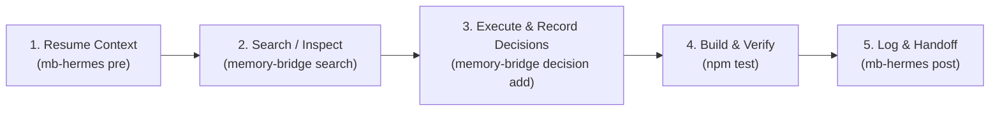

# HERMES.md — Hermes Agent Guidelines for Memory Bridge

Welcome, Hermes Agent! This repository utilizes **Memory Bridge** (`engrene-memory-bridge`) to maintain continuous, portable context across AI sessions and different agents without vendor lock-in.

---

## 🧭 Native Skills & MCP Support

Hermes Agent can interact with Memory Bridge via **two seamless mechanisms**:

1. **Model Context Protocol (MCP)**:
   If the `memory-bridge` MCP server is active in `~/.hermes/config.yaml`, you have direct access to 5 native tools:
   - `memory_resume` — inspect current objective, pending tasks, recent decisions, and handoff snapshot
   - `memory_search` — hybrid search (SQLite FTS5 BM25 + dense vector embeddings)
   - `memory_log` — persist session events (intent, summary, actions, artifacts)
   - `memory_decision` — record architectural or technical decisions with supersedes tracking
   - `memory_handoff` — rebuild and fetch the latest markdown handoff

2. **Native Skill**:
   - Repository path: [`skills/memory-bridge/SKILL.md`](skills/memory-bridge/SKILL.md)
   - Global Hermes path: `~/.hermes/skills/software-development/memory-bridge/SKILL.md`

---

## ⚡ Agent Lifecycle Protocol for Hermes



### 1. Session Start (Resume Context)

Before executing commands, creating plans, or modifying code:

```bash
# Using wrapper:
mb-hermes pre

# Or core CLI:
memory-bridge resume --for hermes
```

If terminal execution is restricted:
- Read `.memory-bridge/handoff.md`
- Read `.memory-bridge/project-context.md`

### 2. Searching Past Decisions & Technical Context

```bash
# Hybrid search (combines SQLite FTS5 BM25 + dense semantic embeddings):
memory-bridge search "<query>" --mode hybrid

# Text search:
memory-bridge search "<query>" --mode text
```

### 3. Recording Architectural or Technical Choices

Whenever you make non-trivial technical choices (dependencies, architecture, schemas):

```bash
memory-bridge decision add \
  --title "Short decision title" \
  --decision "What was decided and chosen" \
  --context "Why this was needed and alternatives considered" \
  --impact "Effects on codebase and downstream components"
```

### 4. Build, Test & Lint

Always ensure tests and memory integrity pass:

```bash
npm run build
npm test
memory-bridge doctor
```

### 5. Session Wrap-Up & Handoff

Always conclude your turn by recording your work and building the handoff for the next agent:

```bash
# Using wrapper (automatically logs and rebuilds handoff in one step):
mb-hermes post \
  --intent "<what user requested>" \
  --summary "<concise description of changes made>" \
  --actions "task 1,task 2" \
  --artifacts "file1.ts,file2.md" \
  --tags "feature,fix,docs"
```

---

## 🔒 Security & Local-First Principles

1. **100% Local-First**: All memory is stored under `.memory-bridge/` on disk.
2. **Zero Runtime Dependencies**: The core uses pure Node.js stdlib.
3. **Automatic Redaction**: API keys, tokens, and private keys are scrubbed before persistence.
4. **Zero Daemons**: No background daemon required. Everything executes in milliseconds and terminates immediately.

---

## ⚖️ Deep Dive: Hermes Hindsight Plugin vs. Engrene Memory Bridge

Hermes Agent (developed by Nous Research) comes with a built-in memory plugin called **Hindsight** located at `plugins/memory/hindsight/`. When working with Hermes, developers often wonder: **"What is Hindsight, why does Hermes have it, and why should I use Engrene Memory Bridge instead (or alongside it)?"**

Here is the complete, transparent architectural breakdown.

---

### 1. What is Hermes Hindsight?

Hindsight is an automated episodic and entity-graph memory engine tailored specifically for the Python runtime of Hermes Agent:
* **Technology Stack**: Python, `hindsight-client` (v0.6.1+), Hugging Face `transformers`, `sentence-transformers`, and PyTorch/SQLite.
* **Execution Modes**:
  1. `local_embedded`: Spawns an internal Python HTTP daemon/process, downloading transformer weights locally to compute dense vector embeddings and extract entity relationships.
  2. `cloud / remote`: Sends conversation text and observation turns to an external Hindsight API endpoint, requiring a paid or hosted `HINDSIGHT_API_KEY`.
* **Storage Location**: Stored globally in user-level hidden databases (e.g. `~/.hermes/memories/` or internal SQLite/graph tables).

---

### 2. Why Hindsight Causes Friction in Modern Dev Workflows

While Hindsight has impressive knowledge-graph capabilities, in real-world multi-agent software engineering it introduces significant operational bottlenecks:

| Limitation in Hindsight | Real-World Pain Point |
|---|---|
| **Siloed in Hermes Only** | **Zero Cross-Tool Continuity**: The moment you switch from Hermes to **Claude Code**, **Cursor**, **Codex**, **Gemini**, or **Antigravity**, the memory is lost. Other agents have zero access to Hermes' internal SQLite/graph databases. |
| **Heavy Resource Overhead** | **RAM & Battery Drain**: Running PyTorch, Hugging Face Transformers, and tokenizers locally consumes hundreds of megabytes (often gigabytes) of memory, prolongs startup times, and drains battery on laptops. |
| **Daemon & Port Fragility** | **Background Process Failures**: Operating background daemons on local ports leads to port collisions, orphaned processes, and connection timeouts if the daemon crashes or fails to boot. |
| **Opaque Black-Box Data** | **Non-Auditable**: Memories are serialized in internal binary/database schemas outside the repository. You cannot run `git diff` on what the agent learned, and team members cannot review memory updates in Pull Requests. |
| **Cloud Lock-In Risk** | When running in hosted mode, project context and code snippets are dispatched to external cloud APIs, violating strict zero-trust or offline/air-gapped privacy requirements. |

---

### 3. How Engrene Memory Bridge Solves This

**Engrene Memory Bridge** was engineered specifically as an open, universal standard for multi-agent software engineering:

1. **Universal Interoperability (The Shared Brain)**:
   - Memory Bridge does not belong to any single AI vendor.
   - It creates a standardized `.memory-bridge/` folder in the project root.
   - **Hermes Agent**, **Claude Code**, **Cursor**, **Codex**, **Gemini**, and **Antigravity** all read from and write to the *exact same memory store*.
   - Example: You brainstorm an architecture in Claude Code (`mb-claude post`), implement features with Hermes Agent (`mb-hermes pre`), and debug in Cursor — everyone shares identical, up-to-date context.

2. **Zero Runtime Dependencies & Zero Daemons**:
   - Built on pure Node.js stdlib (`node:sqlite`, `node:fs`, `node:crypto`).
   - Package weight is **< 90 kB** (compared to > 500 MB for PyTorch/transformers).
   - Execution is purely **stateless and instantaneous** (< 50ms startup). It executes, reads or writes, and immediately exits. 0 MB background RAM usage.

3. **100% Transparent & Git-Auditable**:
   - Core handoff and context are human-readable Markdown (`handoff.md`, `project-context.md`).
   - Session events and architectural decisions are append-only JSON Lines (`decisions.jsonl`, `sessions/*.jsonl`).
   - Every single decision and task handoff is visible in `git status`, `git diff`, and Pull Requests.

4. **Hybrid Search Without Heavy ML Runtimes**:
   - Uses SQLite's native FTS5 engine for full-text BM25 search.
   - Combines lexical search with lightweight semantic vector embeddings and Reciprocal Rank Fusion (RRF) directly inside SQLite without needing gigabytes of Python packages.

---

### 4. Direct Architectural Comparison Matrix

| Feature | Hermes Hindsight Plugin | Engrene Memory Bridge |
|---|---|---|
| **Target Audience** | Single-agent Hermes Python ecosystem | Multi-agent universal developer workflows |
| **Cross-Tool Interoperability** | ❌ None (Hermes only) | ✅ Universal (Hermes, Claude, Cursor, Codex, Gemini, Antigravity, Aider) |
| **Runtime & Dependencies** | ❌ Python + PyTorch + `transformers` + `sentence-transformers` | ✅ Zero runtime dependencies (Pure Node.js standard library, < 90 kB) |
| **Background Processes** | ❌ Requires background daemons/ports (`local_embedded`) or API | ✅ 0 daemons (Completely stateless CLI & stdio MCP) |
| **Storage Format** | ❌ Opaque internal database / entity graph in `~/.hermes/` | ✅ Human-readable Markdown (`.md`) + JSONL in repo `.memory-bridge/` |
| **Git & PR Auditing** | ❌ Incompatible with Git reviews | ✅ 100% Git-native, reviewable in `git diff` and PRs |
| **Search Architecture** | Entity graph resolution + dense vectors | SQLite FTS5 (BM25) + dense vector embeddings + RRF |
| **Context Window Consumption** | Dynamic graph traversal (variable token usage) | Ultra-lean, surgical context injection (~30-50 lines) |
| **Secrets & Privacy** | Manual or relies on remote service policies | Proactive automatic redaction of API keys, tokens, and certs |
| **Installation** | Manual Python pip virtualenv setup + model weight download | 1-Click: `memory-bridge install hermes` |

---

### 5. Can I Use Both?

**Yes.**
* If you enjoy Hermes' entity graph for natural conversation history, you can keep Hindsight enabled in Hermes.
* But for **repository context, architectural decisions, task continuity, and cross-agent collaboration** (switching between Claude Code, Cursor, and Hermes), use **Engrene Memory Bridge** as your project's single source of truth.

To set Memory Bridge as your Hermes memory provider:
```bash
# 1-Click configuration of Hermes MCP and Skill:
memory-bridge install hermes
```
This automatically registers the `memory-bridge` MCP server in `~/.hermes/config.yaml` and deploys the Hermes-compatible skill to `~/.hermes/skills/software-development/memory-bridge/SKILL.md`.


