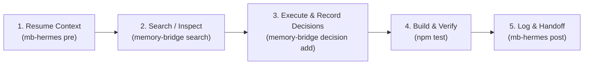

# HERMES.md — Hermes Agent Guidelines for Memory Bridge

Welcome, Hermes Agent! This repository utilizes **Memory Bridge** (`engrene-memory-bridge`) to maintain continuous, portable context across AI sessions and different agents without vendor lock-in.

---

## 🧭 Native Skills & MCP Support

Hermes Agent can interact with Memory Bridge via **two seamless mechanisms**:

1. **Model Context Protocol (MCP)**:
   If the `memory-bridge` MCP server is active in `~/.hermes/config.yaml`, you have direct access to 5 native tools:
   - `memory_resume` — inspect current objective, pending tasks, recent decisions, and handoff snapshot
   - `memory_search` — hybrid search (SQLite FTS5 BM25 + dense vector embeddings)
   - `memory_log` — persist session events (intent, summary, actions, artifacts)
   - `memory_decision` — record architectural or technical decisions with supersedes tracking
   - `memory_handoff` — rebuild and fetch the latest markdown handoff

2. **Native Skill**:
   - Repository path: [`skills/memory-bridge/SKILL.md`](skills/memory-bridge/SKILL.md)
   - Global Hermes path: `~/.hermes/skills/software-development/memory-bridge/SKILL.md`

---

## ⚡ Agent Lifecycle Protocol for Hermes



### 1. Session Start (Resume Context)

Before executing commands, creating plans, or modifying code:

```bash
# Using wrapper:
mb-hermes pre

# Or core CLI:
memory-bridge resume --for hermes
```

If terminal execution is restricted:
- Read `.memory-bridge/handoff.md`
- Read `.memory-bridge/project-context.md`

### 2. Searching Past Decisions & Technical Context

```bash
# Hybrid search (combines SQLite FTS5 BM25 + dense semantic embeddings):
memory-bridge search "<query>" --mode hybrid

# Text search:
memory-bridge search "<query>" --mode text
```

### 3. Recording Architectural or Technical Choices

Whenever you make non-trivial technical choices (dependencies, architecture, schemas):

```bash
memory-bridge decision add \
  --title "Short decision title" \
  --decision "What was decided and chosen" \
  --context "Why this was needed and alternatives considered" \
  --impact "Effects on codebase and downstream components"
```

### 4. Build, Test & Lint

Always ensure tests and memory integrity pass:

```bash
npm run build
npm test
memory-bridge doctor
```

### 5. Session Wrap-Up & Handoff

Always conclude your turn by recording your work and building the handoff for the next agent:

```bash
# Using wrapper (automatically logs and rebuilds handoff in one step):
mb-hermes post \
  --intent "<what user requested>" \
  --summary "<concise description of changes made>" \
  --actions "task 1,task 2" \
  --artifacts "file1.ts,file2.md" \
  --tags "feature,fix,docs"
```

---

## 🔒 Security & Local-First Principles

1. **100% Local-First**: All memory is stored under `.memory-bridge/` on disk.
2. **Zero Runtime Dependencies**: The core uses pure Node.js stdlib.
3. **Automatic Redaction**: API keys, tokens, and private keys are scrubbed before persistence.
4. **Zero Daemons**: No background daemon required. Everything executes in milliseconds and terminates immediately.
