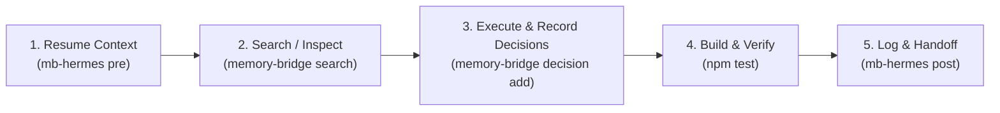

# HERMES.md — Hermes Agent Guidelines for Memory Bridge

Welcome, Hermes Agent! This repository utilizes **Memory Bridge** (`engrene-memory-bridge`) to maintain continuous, portable context across AI sessions and different agents without vendor lock-in.

---

## 🧭 Native Skills & MCP Support

Hermes Agent can interact with Memory Bridge via **two seamless mechanisms**:

1. **Model Context Protocol (MCP)**:
   If the `memory-bridge` MCP server is active in `~/.hermes/config.yaml`, you have direct access to 5 native tools:
   - `memory_resume` — inspect current objective, pending tasks, recent decisions, and handoff snapshot
   - `memory_search` — hybrid search (SQLite FTS5 BM25 + dense vector embeddings)
   - `memory_log` — persist session events (intent, summary, actions, artifacts)
   - `memory_decision` — record architectural or technical decisions with supersedes tracking
   - `memory_handoff` — rebuild and fetch the latest markdown handoff

2. **Native Skill**:
   - Repository path: [`skills/memory-bridge/SKILL.md`](skills/memory-bridge/SKILL.md)
   - Global Hermes path: `~/.hermes/skills/software-development/memory-bridge/SKILL.md`

---

## ⚡ Agent Lifecycle Protocol for Hermes


```mermaid
flowchart LR
    A["1. Resume Context\n(mb-hermes pre)"] --> B["2. Search / Inspect\n(memory-bridge search)"]
    B --> C["3. Execute & Record Decisions\n(memory-bridge decision add)"]
    C --> D["4. Build & Verify\n(npm test)"]
    D --> E["5. Log & Handoff\n(mb-hermes post)"]
```

### 1. Session Start (Resume Context)

Before executing commands, creating plans, or modifying code:

```bash
# Using wrapper:
mb-hermes pre

# Or core CLI:
memory-bridge resume --for hermes
```

If terminal execution is restricted:
- Read `.memory-bridge/handoff.md`
- Read `.memory-bridge/project-context.md`

### 2. Searching Past Decisions & Technical Context

```bash
# Hybrid search (combines SQLite FTS5 BM25 + dense semantic embeddings):
memory-bridge search "<query>" --mode hybrid

# Text search:
memory-bridge search "<query>" --mode text
```

### 3. Recording Architectural or Technical Choices

Whenever you make non-trivial technical choices (dependencies, architecture, schemas):

```bash
memory-bridge decision add \
  --title "Short decision title" \
  --decision "What was decided and chosen" \
  --context "Why this was needed and alternatives considered" \
  --impact "Effects on codebase and downstream components"
```

### 4. Build, Test & Lint

Always ensure tests and memory integrity pass:

```bash
npm run build
npm test
memory-bridge doctor
```

### 5. Session Wrap-Up & Handoff

Always conclude your turn by recording your work and building the handoff for the next agent:

```bash
# Using wrapper (automatically logs and rebuilds handoff in one step):
mb-hermes post \
  --intent "<what user requested>" \
  --summary "<concise description of changes made>" \
  --actions "task 1,task 2" \
  --artifacts "file1.ts,file2.md" \
  --tags "feature,fix,docs"
```

---

## 🔒 Security & Local-First Principles

1. **100% Local-First**: All memory is stored under `.memory-bridge/` on disk.
2. **Zero Runtime Dependencies**: The core uses pure Node.js stdlib.
3. **Automatic Redaction**: API keys, tokens, and private keys are scrubbed before persistence.
4. **Zero Daemons**: No background daemon required. Everything executes in milliseconds and terminates immediately.

---

## ⚖️ Hindsight vs. Engrene Memory Bridge

Hindsight, by **vectorize-io**, is the memory engine most people will compare this project against. It is worth being precise about what it does, because it does more than a Hermes plugin.

Written by the Memory Bridge maintainers. Verify anything that matters to you; the sources are linked.

---

### 1. What Hindsight is

Two separate things share the name.

**The Hermes plugin** (`plugin-catalog/hindsight.yaml`, community tier, v1.0.1, requires Hermes `>=0.21.4`): knowledge graph, entity resolution, `recall` / `reflect` / `retain`, and automatic per-turn capture. Runs in `cloud`, `local embedded` or `local external` mode. In embedded mode the `hindsight-all` PyPI package is lazy-installed into the Hermes virtualenv.

**The Coding Agents integration**, which is the one that overlaps with this project. Per [its documentation](https://hindsight.vectorize.io/sdks/integrations/coding-agents):

* One package covers **40+ coding agents**, including Claude Code, Codex CLI, Cursor CLI, Kilo CLI, opencode and GitHub Copilot CLI.
* **One memory bank per repository, shared by every agent.** The default bank template is `coding-agent::{gitProject}`, and linked worktrees of the same repo share a bank.
* **Ingestion is automatic**, with no setup command: session/prompt/stop hooks plus continuous ingestion of git history, commit messages and optionally full diffs.
* Storage is **outside the repository**: Hindsight Cloud, a self-hosted server, or a local daemon on `127.0.0.1:9077` writing to `~/.hindsight/`.
* Even the local daemon requires an **LLM API key** (OpenAI, Anthropic, Gemini or Groq) for fact extraction.

If you are looking for the broadest automatic memory across coding agents, that is Hindsight, and this project does not match it.

---

### 2. Where Hindsight is stronger

Stated plainly, because pretending otherwise wastes your time.

| | Hindsight |
|---|---|
| **Automatic capture** | Hooks record every session with no agent cooperation. Memory Bridge only records what an agent explicitly logs, so a forgetful agent leaves no trace. |
| **Agent coverage** | 40+ integrations in one package, maintained full time. This project ships thin `mb-*` wrappers and an MCP server. |
| **Git history ingestion** | Commits and diffs flow into memory continuously. We record only what a session reports. |
| **Retrieval** | Knowledge graph and entity resolution. Ours is BM25 plus local embeddings; our own benchmark puts the pure semantic path at P@3 0.315, well below the lexical one. |

---

### 3. Where Memory Bridge is different

Three differences, and they follow from architecture rather than from effort, which is why they are unlikely to close.

1. **Memory lives in the repository and is reviewable.** `.memory-bridge/` is JSONL and Markdown next to the code. What the agent recorded shows up in `git diff`, travels with `git clone` and `git pull`, and can be challenged in a pull request. Hindsight stores outside the repo by design, so its memory cannot be reviewed that way. In this repository, a session that an agent wrote about the wrong project was caught precisely because it appeared in a diff.

2. **Fully offline, with no API key.** Zero runtime dependencies, 110 kB packed, no daemon, no network, no LLM key. Hindsight needs a key for fact extraction even in local daemon mode. For air-gapped work, or for anyone unwilling to send code to an extraction service, that is the deciding factor.

3. **Deterministic records.** A decision is stored as written, with its context, impact and `supersedes` chain. Nothing is inferred. LLM extraction is more powerful and can also be wrong in ways nobody sees; here, what you read is what was written.

---

### 4. Which to choose

* **Want the broadest automatic memory across many coding agents, and are fine with an external store and an API key?** Use Hindsight.
* **Need memory that is versioned with the code, reviewable in a PR, and runs with no network and no key?** Use Memory Bridge.
* **Using Hermes and want conversational recall with an entity graph?** That is Hindsight's home ground.

They are not mutually exclusive. `memory-bridge install hermes` registers the MCP server and skill in Hermes, and nothing stops Hindsight from running at the same time.

---

### 5. What we measured, and what we did not

This comparison is written by the Memory Bridge maintainers, so treat it accordingly and verify anything that matters to you.

- **Measured**: Memory Bridge's own package size, dependency count and retrieval quality. The retrieval numbers are in `docs/benchmarks/`, including the weak spot: on our own fixtures the pure semantic mode reaches P@3 0.315 and R@5 0.676, well below the lexical path.
- **Not measured**: Hindsight's memory footprint, startup time and retrieval quality. We have not benchmarked it head to head. Statements about its runtime come from the Hermes catalog entry, not from our own runs.

Section 2 above lists where Hindsight is stronger; none of that is softened here.

---

### 6. Running both

Nothing stops you. Hindsight can keep handling conversational recall while Memory Bridge holds the project's written record.

To set Memory Bridge as your Hermes memory provider:
```bash
# 1-Click configuration of Hermes MCP and Skill:
memory-bridge install hermes
```
This automatically registers the `memory-bridge` MCP server in `~/.hermes/config.yaml` and deploys the Hermes-compatible skill to `~/.hermes/skills/software-development/memory-bridge/SKILL.md`.


