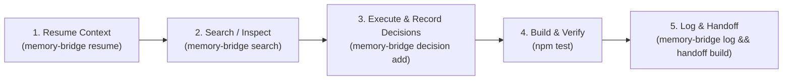

# 🧠 Engrene Memory Bridge (`engrene-memory-bridge`)

> **One project. One memory. Any AI agent.**  
> An open, local-first memory protocol for AI coding agents (Antigravity, Claude Code, Cursor, Copilot, Aider, Windsurf, Hermes, Gemini, Codex). Zero runtime dependencies, 100% offline, git-native.

[](https://www.npmjs.com/package/engrene-memory-bridge)
[](LICENSE)
[](https://nodejs.org/)

---

## 🌐 Language / Idioma
* Read this in English (default below)
* 🇧🇷 [Versão em Português / Portuguese Version](#-versão-em-português)

---

## 🚀 Key Value Propositions

### 1. 💰 Massive Token Savings for Local Development
Instead of burning thousands of context window tokens feeding full chat histories or redundant file dumps to your LLM:
- Memory Bridge uses **BM25 + Joint Embedding Vectors (JEV)** hybrid search to retrieve *only the exact relevant context*.
- Consolidated [`handoff.md`](.memory-bridge/handoff.md) snapshots provide high-level task goals and next steps without blowing up your token budget.

### 2. 🌍 Remote Portability & Seamless Handoff
All memory artifacts are plain JSONL and Markdown inside `.memory-bridge/`, so they can be committed and pulled like code.
- **Private by default:** `init` adds `.memory-bridge/` to your `.gitignore`, so nothing leaves your machine until you opt in.
- **To share memory across machines**, replace that line with the local-only files: `.memory-bridge/vector.sqlite` (search index, rebuilt by `search`), `.memory-bridge/.lock` and `.memory-bridge/observations/` (raw captures). `init` leaves that selective configuration alone. Then **switching to a remote server or SSH container is a `git pull`**: decisions, sessions and handoff state travel with the repo. This repository does exactly that with its own `.memory-bridge/`.
- Secret redaction runs before anything is written, and optional encryption (see Privacy & Security) protects committed memory.

### 3. 🔓 Zero Vendor Lock-in & Zero Runtime Dependencies
- Operates **100% offline** using standard Node.js built-ins (`node:crypto`, `node:fs`, and `node:sqlite`). Note: `node:sqlite` ships with Node.js 22.5+. On Node.js 20 the CLI still works, but FTS5, semantic and hybrid search fall back to in-memory BM25.
- No heavy Docker containers, no paid cloud memory APIs, no API key leaks.

---

## ⚡ Quick Start

```bash
# Global installation via npm
npm install -g engrene-memory-bridge

# Initialize memory in your repository
npx engrene-memory-bridge init
```

### 📦 Footprint
What gets installed is small. Measured with `npm pack --dry-run` on v0.3.0:

| Measure | Value |
| :--- | :--- |
| Package size (tarball) | 109 kB |
| Unpacked size | 495 kB |
| Runtime dependencies | 0 (Node.js 20+ built-ins only) |

The `mb-*` commands (`mb-claude`, `mb-codex`, `mb-hermes`, ...) are three-line aliases over one shared wrapper (`src/wrappers/common.ts`), not separate integrations to maintain. The GitHub repository is larger than the package because it ships docs, assets and history; none of that is installed.

---

## 🧩 Native Ecosystem Integrations

### 🔮 1. Obsidian Vault Synchronization (bidirectional)
Sync project memory with your Obsidian Vault as Markdown notes with YAML frontmatter and **wikilinks** (`[[dec-123]]`), so decision lineage shows up in Obsidian's **Graph View**. The sync works in both directions: edit a decision or session note in Obsidian and pull it back into `.memory-bridge/`.

```bash
memory-bridge obsidian --vault ~/MyObsidianVault          # export: bridge -> vault
memory-bridge obsidian import --vault ~/MyObsidianVault   # import: vault -> bridge
memory-bridge obsidian sync --vault ~/MyObsidianVault     # both (import first, then export)
```

- `Decisions/*.md` are matched by the `id` in their frontmatter. A note you wrote by hand without an `id` becomes a new decision and gets its `id` written back, and later exports keep your file name.
- `Sessions/*.md` are matched by timestamp + tool. `Handoff.md` is generated on export and ignored on import.
- Import is idempotent. When a record differs on both sides, `--prefer vault` (default) or `--prefer bridge` decides.
- Secret redaction runs on imported content, same as `log` and `decision add`.
- Set `integrations.obsidian.vaultDir` and `"autoImport": true` in `.memory-bridge/config.json` to pull vault edits before every `resume`.

### ⚙️ 2. Compound Engineering (CE) Multi-Agent Sync
Automatically sync active decisions, pitfalls, and memory lifecycle protocols across all popular AI assistant configuration files with a single command:

```bash
memory-bridge ce
```
Instantly generates and updates:
- `AGENTS.md` (Universal multi-agent instructions)
- `.cursorrules` (Cursor IDE)
- `CLAUDE.md` (Claude Code / Anthropic CLI)
- `.github/copilot-instructions.md` (GitHub Copilot)

### 🔌 3. Model Context Protocol (MCP) Server
Native MCP stdio server support for Claude Desktop, Cursor, Windsurf, and VS Code.

```bash
memory-bridge mcp
```
**`mcpServers` Configuration:**
```json
{
  "mcpServers": {
    "memory-bridge": {
      "command": "npx",
      "args": ["-y", "engrene-memory-bridge", "mcp"]
    }
  }
}
```

### 🛠️ 4. Native Skill for Antigravity & Gemini
Install the native skill globally or locally in your workspace:
```bash
memory-bridge install antigravity
```

---

## 🔄 Memory Bridge Lifecycle Protocol



1. **Session Start**: Resume active context:
   ```bash
   memory-bridge resume --for antigravity
   ```
2. **Hybrid Search (BM25 + JEV Vectors)**:
   ```bash
   memory-bridge search "how do we store api keys" --mode hybrid
   ```
3. **Record Architectural Decisions**:
   ```bash
   memory-bridge decision add \
     --title "Local-First Architecture" \
     --decision "Use filesystem JSONL and native SQLite" \
     --context "Avoid third-party cloud APIs" \
     --impact "Full privacy and offline support"
   ```
4. **Session Wrap-Up & Handoff**:
   ```bash
   memory-bridge log --tool antigravity --intent "Implement feature X" --summary "Created module X and tests"
   memory-bridge handoff build
   ```

---

## 📋 CLI Command Reference

| Command | Description |
| :--- | :--- |
| `memory-bridge init` | Initialize `.memory-bridge/` structure in your workspace. |
| `memory-bridge resume --for <tool>` | Retrieve active goals, pending tasks, and decisions. |
| `memory-bridge search <query>` | Perform text, semantic, or hybrid (BM25 + JEV) search. |
| `memory-bridge decision add` | Append a durable architectural decision. |
| `memory-bridge log` | Log completed session events, actions, and artifacts. |
| `memory-bridge handoff build` | Consolidate memory into [`handoff.md`](.memory-bridge/handoff.md). |
| `memory-bridge obsidian [export\|import\|sync]` | Export memory notes to an Obsidian Vault, import vault edits back, or both. |
| `memory-bridge ce` | Sync Compound Engineering rules (`AGENTS.md`, `.cursorrules`, etc.). |
| `memory-bridge mcp` | Start stdio MCP server for IDEs. |
| `memory-bridge ui` | Launch local Web Dashboard on port 8787. |
| `memory-bridge doctor` | Inspect memory store health and lint integrity. |

---

## 🇧🇷 Versão em Português

### 💡 Destaques em Português
- **Economia Drástica de Tokens**: Evite enviar históricos gigantes para a IA. O Memory Bridge pré-filtra via BM25 + JEV e injeta apenas o contexto estritamente necessário.
- **Continuidade Portátil**: A memória é JSONL + Markdown em `.memory-bridge/`, pronta para ser commitada. Por padrão o `init` coloca a pasta no `.gitignore` (privado até você optar); troque essa linha por `.memory-bridge/vector.sqlite`, `.memory-bridge/.lock` e `.memory-bridge/observations/` e um `git pull` passa a transferir decisões, sessões e handoff entre máquinas ou servidores remotos.
- **Obsidian & Compound Engineering**: Sincronize memórias com o Obsidian nos dois sentidos (`obsidian`, `obsidian import`, `obsidian sync`), com Wikilinks (`[[dec-123]]`) no Graph View, e mantenha `.cursorrules`, `AGENTS.md` e `CLAUDE.md` atualizados automaticamente via `memory-bridge ce`.
- **Tamanho instalado**: 109 kB compactado, 495 kB descompactado, zero dependências de runtime (medido com `npm pack --dry-run`). Os 16 comandos `mb-*` são aliases de três linhas sobre um único wrapper.

---

## 🛡️ Privacy & Security
- **Automatic Secret Redaction**: Common API keys, JWTs, and tokens are scrubbed before persistence.
- **Optional AES-256-GCM Encryption**: Local envelope encryption configured in `config.json`.

---

## 📄 License
Licensed under the [MIT License](LICENSE). Built by the **Engrene** community.
