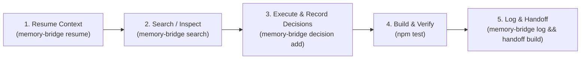

# 🧠 Engrene Memory Bridge (`engrene-memory-bridge`)

> **One project. One memory. Any AI agent.**  
> An open, local-first memory protocol for AI coding agents (Antigravity, Claude Code, Cursor, Copilot, Aider, Windsurf, Hermes, Gemini, Codex). Zero runtime dependencies, 100% offline, git-native.

[](https://www.npmjs.com/package/engrene-memory-bridge)
[](LICENSE)
[](https://nodejs.org/)

---

## 🌐 Language / Idioma
* Read this in English (default below)
* 🇧🇷 [Versão em Português / Portuguese Version](#-versão-em-português)

---

## 🚀 Key Value Propositions

### 1. 💰 Massive Token Savings for Local Development
Instead of burning thousands of context window tokens feeding full chat histories or redundant file dumps to your LLM:
- Memory Bridge uses **BM25 + Joint Embedding Vectors (JEV)** hybrid search to retrieve *only the exact relevant context*.
- Consolidated [`handoff.md`](.memory-bridge/handoff.md) snapshots provide high-level task goals and next steps without blowing up your token budget.

### 2. 🌍 Remote Portability & Seamless Handoff
All memory artifacts live inside `.memory-bridge/` tracked directly in **Git**.
- **Working locally and need to switch to a remote server or SSH container?** Simply `git pull`.
- 100% of episodic memory, architectural decisions, and handoff state transfer instantly across machines and AI tools.

### 3. 🔓 Zero Vendor Lock-in & Zero Runtime Dependencies
- Operates **100% offline** using standard Node.js 20+ built-ins (`node:sqlite`, `node:crypto`, `node:fs`).
- No heavy Docker containers, no paid cloud memory APIs, no API key leaks.

---

## ⚡ Quick Start

```bash
# Global installation via npm
npm install -g engrene-memory-bridge

# Initialize memory in your repository
npx engrene-memory-bridge init
```

---

## 🧩 Native Ecosystem Integrations

### 🔮 1. Obsidian Vault Synchronization
Sync project memory directly into your Obsidian Vault with Markdown notes, YAML frontmatter, and **wikilinks** (`[[dec-123]]`) to visualize decision lineage in Obsidian's **Graph View**.

```bash
memory-bridge obsidian --vault ~/MyObsidianVault
```

### ⚙️ 2. Compound Engineering (CE) Multi-Agent Sync
Automatically sync active decisions, pitfalls, and memory lifecycle protocols across all popular AI assistant configuration files with a single command:

```bash
memory-bridge ce
```
Instantly generates and updates:
- `AGENTS.md` (Universal multi-agent instructions)
- `.cursorrules` (Cursor IDE)
- `CLAUDE.md` (Claude Code / Anthropic CLI)
- `.github/copilot-instructions.md` (GitHub Copilot)

### 🔌 3. Model Context Protocol (MCP) Server
Native MCP stdio server support for Claude Desktop, Cursor, Windsurf, and VS Code.

```bash
memory-bridge mcp
```
**`mcpServers` Configuration:**
```json
{
  "mcpServers": {
    "memory-bridge": {
      "command": "npx",
      "args": ["-y", "engrene-memory-bridge", "mcp"]
    }
  }
}
```

### 🛠️ 4. Native Skill for Antigravity & Gemini
Install the native skill globally or locally in your workspace:
```bash
memory-bridge install antigravity
```

---

## 🔄 Memory Bridge Lifecycle Protocol



1. **Session Start**: Resume active context:
   ```bash
   memory-bridge resume --for antigravity
   ```
2. **Hybrid Search (BM25 + JEV Vectors)**:
   ```bash
   memory-bridge search "how do we store api keys" --mode hybrid
   ```
3. **Record Architectural Decisions**:
   ```bash
   memory-bridge decision add \
     --title "Local-First Architecture" \
     --decision "Use filesystem JSONL and native SQLite" \
     --context "Avoid third-party cloud APIs" \
     --impact "Full privacy and offline support"
   ```
4. **Session Wrap-Up & Handoff**:
   ```bash
   memory-bridge log --tool antigravity --intent "Implement feature X" --summary "Created module X and tests"
   memory-bridge handoff build
   ```

---

## 📋 CLI Command Reference

| Command | Description |
| :--- | :--- |
| `memory-bridge init` | Initialize `.memory-bridge/` structure in your workspace. |
| `memory-bridge resume --for <tool>` | Retrieve active goals, pending tasks, and decisions. |
| `memory-bridge search <query>` | Perform text, semantic, or hybrid (BM25 + JEV) search. |
| `memory-bridge decision add` | Append a durable architectural decision. |
| `memory-bridge log` | Log completed session events, actions, and artifacts. |
| `memory-bridge handoff build` | Consolidate memory into [`handoff.md`](.memory-bridge/handoff.md). |
| `memory-bridge obsidian` | Sync and export memory notes to an Obsidian Vault. |
| `memory-bridge ce` | Sync Compound Engineering rules (`AGENTS.md`, `.cursorrules`, etc.). |
| `memory-bridge mcp` | Start stdio MCP server for IDEs. |
| `memory-bridge ui` | Launch local Web Dashboard on port 8787. |
| `memory-bridge doctor` | Inspect memory store health and lint integrity. |

---

## 🇧🇷 Versão em Português

### 💡 Destaques em Português
- **Economia Drástica de Tokens**: Evite enviar históricos gigantes para a IA. O Memory Bridge pré-filtra via BM25 + JEV e injeta apenas o contexto estritamente necessário.
- **Continuidade Portátil**: A memória é salva em `.memory-bridge/` no próprio Git. Um simples `git pull` transfere 100% do progresso entre máquinas ou servidores remotos.
- **Obsidian & Compound Engineering**: Exporte memórias para o Obsidian Graph View com Wikilinks (`[[dec-123]]`) e sincronize `.cursorrules`, `AGENTS.md` e `CLAUDE.md` automaticamente via `memory-bridge ce`.

---

## 🛡️ Privacy & Security
- **Automatic Secret Redaction**: Common API keys, JWTs, and tokens are scrubbed before persistence.
- **Optional AES-256-GCM Encryption**: Local envelope encryption configured in `config.json`.

---

## 📄 License
Licensed under the [MIT License](LICENSE). Built by the **Engrene** community.
