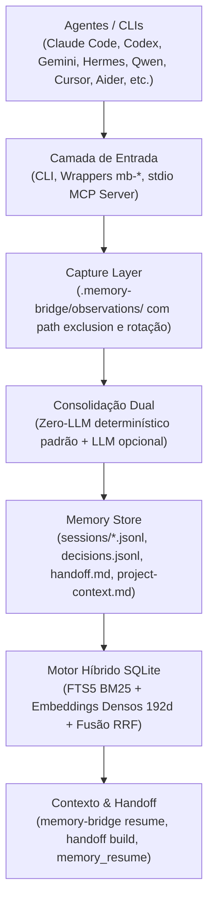

# engrene-memory-bridge

<p align="center">
  
</p>

<p align="center">
  <a href="https://www.npmjs.com/package/engrene-memory-bridge"></a>
  <a href="https://nodejs.org"></a>
  <a href="https://opensource.org/licenses/MIT"></a>
  
  
  
</p>

<p align="center">
  <strong>An open memory protocol for AI coding agents.</strong><br />
  <em>One project. One memory. Any agent.</em><br />
  Continuous context across Hermes Agent, Claude Code, Cursor, Codex, Gemini CLI, Qwen Code, Antigravity, and Aider.
</p>

---

## Main value

Use this when you want one tool session to continue from another tool session.

In practice, this means:

- IDE A logs work.
- IDE/CLI B resumes from that exact context.
- Teams can switch tools without losing project continuity.

## Core idea

Every tool reads and writes the same memory contract across a complete 5-stage lifecycle:

1. **Capture**: Capture interactions or granular tool observations (`memory-bridge observe`)
2. **Index**: Real-time SQLite FTS5 & Dense vector embeddings (`memory-bridge search --mode hybrid`)
3. **Consolidate**: Synthesize pending observations and deduplicate decisions (`memory-bridge consolidate`)
4. **Retrieve**: Instant contextual recovery via CLI (`resume`) or stdio JSON-RPC MCP (`memory-bridge mcp`)
5. **Handoff**: Clean, human-readable markdown generation (`handoff build`)



This is how context survives tool and model switching.

## ⚡ Zero Background Daemons: Does npm need to be running?

**No! Nothing needs to run in the background.**

* **Zero Daemons / Zero Memory Overhead**: Memory Bridge is **not** a continuous service, daemon, or server. There is no `npm start` eating RAM or draining your laptop battery.
* **Instant Disk Execution**: When you or an AI agent runs a command (`memory-bridge log`, `resume`, `decision add`), it executes in **milliseconds**, writes plain text to `.memory-bridge/` on disk, and terminates immediately.
* **Pure Filesystem Persistence**: All memory lives in human-readable Markdown (`.md`) and JSON Lines (`.jsonl`) files. If your machine reboots or the terminal closes, everything is already safe on disk.
* **Direct File Fallback**: Even in restricted environments where terminal execution is disabled, any AI can read and write memory directly using standard file editing.

### 🌐 What is Port 8787 then?

Port `8787` is **strictly for the optional human visual dashboard** (`memory-bridge ui`):

* It is built for **you** (the human developer) to inspect context, read the AI event timeline, and edit objectives in your web browser (`http://127.0.0.1:8787`).
* **AI agents NEVER use port 8787.** They interact directly with local files or via fast CLI commands.
* You can keep the UI server closed (`Ctrl+C`) indefinitely — Memory Bridge and all AI agents will continue saving and synchronizing context seamlessly.

## 🚀 Key Advantages of Memory Bridge

1. **Zero Vendor Lock-in (Multi-AI Freedom)**:
   Switch between **Claude Code**, **Cursor**, **Antigravity**, **GitHub Copilot**, **Codex**, **Aider**, and **Gemini** effortlessly. Session context started in one tool is resumed identically in another.
2. **Local-First & Complete Privacy**:
   Your codebase and memories stay 100% on your local disk. No external vector databases or third-party cloud telemetry required.
3. **Automatic Secret Redaction**:
   API keys, GitHub tokens, private keys, and passwords are automatically scrubbed and redacted before being saved to memory.
4. **Transparent & Auditable**:
   No black-box databases. Plain Markdown and JSON Lines mean you can open git diffs, inspect exactly what was saved, and edit anything by hand.
5. **Zero Runtime Dependencies**:
   Engineered using pure Node.js standard library — zero third-party packages to install at runtime, zero security vulnerabilities.
6. **Battery & Performance Friendly**:
   No persistent Node or Python daemons running silently in the background. Runs only when invoked.

## What gets stored?

Memory Bridge stores operational memory, not full raw transcripts by default.

- Session events: intent, actions, artifacts, summary, tags.
- Decision events: key technical decisions and impact.
- Handoff: a compact current-state summary for the next tool/person.

This keeps memory useful and compact. You get the important context without dumping everything.

## Popular tools that already work

### Official wrappers (ready now, CLI-first)

- Codex (`mb-codex`)
- Claude (`mb-claude`)
- Gemini (`mb-gemini`)
- Hermes Agent (`mb-hermes`)
- Qwen Code (`mb-qwen`)
- Kiro (`mb-kiro`)
- Kilo (`mb-kilo`)
- Copilot CLI (`mb-copilot`)
- Aider (`mb-aider`)
- Antigravity (`mb-antigravity`)
- Trae (`mb-trae`)
- Dyad (`mb-dyad`)
- Replit (`mb-replit`)
- Qoder (`mb-qoder`)
- Cursor (`mb-cursor`)
- VS Code (`mb-vscode`)

### Works via contract (manual commands or hooks)

These are commonly used and can integrate with Memory Bridge through terminal commands and/or tool instructions:

- Cursor
- VS Code (including extensions like Continue/Cline)
- Windsurf
- JetBrains IDEs
- Firebase Studio (via terminal/task scripts)

If a tool can run shell commands or supports pre/post task scripts, it can use the same memory contract.

## Install

```bash
# Install globally from npm:
npm install -g engrene-memory-bridge

# Or run on demand without installing:
npx engrene-memory-bridge resume

# Or install directly from GitHub:
npm install -g git+https://github.com/leninejunior/engrene-memory-bridge.git
```

## 1-minute setup

Inside any project root:

```bash
memory-bridge init
```

This creates:

- `.memory-bridge/config.json`
- `.memory-bridge/project-context.md`
- `.memory-bridge/decisions.jsonl`
- `.memory-bridge/sessions/<yyyy-mm-dd>.jsonl`
- `.memory-bridge/handoff.md`

It also adds `.memory-bridge/` to your `.gitignore`.

## Daily workflow (for users)

### Step 1: Resume context before asking your IDE/agent

```bash
memory-bridge resume --for codex
```

Use that output as session context.

### Step 2: Work normally in your IDE/CLI

Implement changes as usual.

### Step 3: Log what happened

```bash
memory-bridge log \
  --tool codex \
  --intent "Implement MFA hardening" \
  --summary "Added guard + tests" \
  --actions "TODO: load test,update docs" \
  --artifacts "apps/api/src/auth/auth.service.ts,apps/api/src/tests/auth-mfa.unit.test.ts" \
  --tags "security,mfa"
```

### Step 4: Build handoff for the next tool/person

```bash
memory-bridge handoff build
```

### Step 5: Continue in another tool

```bash
memory-bridge resume --for claude
```

## 🤖 AI Agent Standards & Native Skills

Memory Bridge provides zero-setup, first-class instructions so **any AI agent** entering this repository immediately knows how to inspect context, record decisions, run tests, and maintain continuous memory:

| Configuration File | Target AI Tool / Standard |
|---|---|
| [`AGENTS.md`](./AGENTS.md) | **Universal standard** for all autonomous AI coding agents |
| [`HERMES.md`](./HERMES.md) | Hermes Agent (Nous Research) & local autonomous LLMs |
| [`CLAUDE.md`](./CLAUDE.md) | Claude Code CLI & Anthropic models |
| [`.cursorrules`](./.cursorrules) | Cursor IDE Composer & Agent |
| [`.github/copilot-instructions.md`](./.github/copilot-instructions.md) | GitHub Copilot Workspace & CLI |
| [`skills/memory-bridge/SKILL.md`](./skills/memory-bridge/SKILL.md) | Reusable Native Skill definition |
| [`.agents/skills/memory-bridge/SKILL.md`](./.agents/skills/memory-bridge/SKILL.md) | In-repo Native Skill standard path |

If your AI tool supports skills or agent instructions, it will automatically detect and respect these files.

### 🪽 Hermes Agent (Nous Research) Integration

Memory Bridge provides native, first-class support for **Hermes Agent** via automated setup, stdio MCP tools, and autonomous skills:

```bash
# 1-Click Automated Setup for Hermes Agent:
memory-bridge install hermes
```

This command automatically:
- 🔌 Configures the `memory-bridge` stdio MCP server in `~/.hermes/config.yaml`.
- 📦 Installs the Hermes skill package in `~/.hermes/skills/software-development/memory-bridge/`.
- 📄 Verifies repository guidelines in [`HERMES.md`](./HERMES.md).

Once configured, Hermes Agent autonomously accesses 5 native memory tools (`memory_resume`, `memory_search`, `memory_log`, `memory_decision`, `memory_handoff`) to preserve project continuity across sessions and restarts without manual commands!

> 💡 **Why Memory Bridge over Hermes Hindsight?** While Hermes Agent provides an optional plugin called Hindsight, it requires heavy Python dependencies (`transformers`, `sentence-transformers`), active daemons, and remains siloed inside Hermes. Memory Bridge connects Hermes with Claude, Cursor, Codex, and Gemini with zero daemons and zero runtime dependencies. Check out the [full deep dive in HERMES.md](./HERMES.md#-deep-dive-hermes-hindsight-plugin-vs-engrene-memory-bridge) and the 3-way matrix in [ARCHITECTURE_ANALYSIS.md](./ARCHITECTURE_ANALYSIS.md#33-matriz-tripla-de-decisão-arquitetural).

## Visual local dashboard (with editing)

Start the local UI:

```bash
memory-bridge ui
```

Options:

```bash
memory-bridge ui --port 8787 --host 127.0.0.1
memory-bridge ui --readonly
```

The UI supports:

- Editing `project-context.md`
- Editing `handoff.md`
- Creating session events (`log`)
- Creating decision events (`decision add`)
- Rebuilding handoff
- Running doctor and search

## Screenshots

### UI (Light, English)


### UI (Dark, English)


### UI (Light, Portuguese - Brazil)


### UI (Dark, Spanish)


## What should users ask the IDE/agent?

If your IDE does not support hooks, users can copy this instruction template:

```text
Before answering, use the latest Memory Bridge context for this project.
If available, read `.memory-bridge/handoff.md` and recent session/decision events.
After implementing, summarize intent/actions/artifacts so I can run memory-bridge log.
```

If hooks are supported, automate it (recommended).

## Official wrappers

Wrappers already enforce the pre/post flow:

- `mb-codex`
- `mb-claude`
- `mb-gemini`
- `mb-kiro`
- `mb-kilo`
- `mb-copilot`
- `mb-aider`
- `mb-antigravity`
- `mb-trae`
- `mb-dyad`
- `mb-replit`
- `mb-qoder`
- `mb-cursor`
- `mb-vscode`

Examples:

```bash
mb-codex pre --json
mb-codex post \
  --intent "Refactor upload flow" \
  --summary "Done" \
  --actions "TODO: e2e" \
  --artifacts "apps/api/src/documents/documents.service.ts"

mb-gemini pre --json
mb-gemini post \
  --intent "Continue auth hardening" \
  --summary "Added token checks" \
  --actions "TODO: benchmark" \
  --artifacts "apps/api/src/auth/token.guard.ts"
```

## Windows helpers (PowerShell and cmd)

Ready-to-use scripts are available in [`scripts/windows`](./scripts/windows/README.md):

- `scripts/windows/mb.ps1` (recommended, no global install)
- `scripts/windows/mb.cmd` (recommended, no global install)
- `scripts/windows/mb-pre.ps1`
- `scripts/windows/mb-post.ps1`
- `scripts/windows/mb-pre.cmd`
- `scripts/windows/mb-post.cmd`

Recommended quick start (PowerShell, no global install):

```powershell
.\scripts\windows\mb.ps1 init
.\scripts\windows\mb.ps1 doctor
.\scripts\windows\mb.ps1 resume --for codex
```

Recommended quick start (cmd, no global install):

```cmd
scripts\windows\mb.cmd init
scripts\windows\mb.cmd doctor
scripts\windows\mb.cmd resume --for codex
```

PowerShell example:

```powershell
.\scripts\windows\mb-pre.ps1 -Tool codex
.\scripts\windows\mb-post.ps1 -Tool codex -Intent "Fix auth flow" -Summary "Added guard checks" -Actions "TODO: e2e" -Artifacts "src/auth.ts" -Tags "auth,fix"
```

cmd example:

```cmd
scripts\windows\mb-pre.cmd -Tool codex
scripts\windows\mb-post.cmd -Tool codex -Intent "Fix auth flow" -Summary "Added guard checks" -Actions "TODO: e2e" -Artifacts "src/auth.ts" -Tags "auth,fix"
```

## Linux & macOS helpers (Bash and Zsh)

Ready-to-use scripts are available in [`scripts/linux`](./scripts/linux/README.md):

- `scripts/linux/mb.sh` (recommended, runs local build or via `npx`, no global install required)
- `scripts/linux/mb-pre.sh`
- `scripts/linux/mb-post.sh`

Quick start:

```bash
chmod +x scripts/linux/*.sh
./scripts/linux/mb.sh init
./scripts/linux/mb.sh doctor
./scripts/linux/mb.sh resume --for codex
```

Bash/Zsh example:

```bash
./scripts/linux/mb-pre.sh --tool codex
./scripts/linux/mb-post.sh --tool codex --intent "Fix auth flow" --summary "Added guard checks" --actions "TODO: e2e" --artifacts "src/auth.ts" --tags "auth,fix" --task-id "task-01"
```

## Security

### Redaction (enabled by default)

Sensitive patterns are redacted before persistence (API keys, tokens, passwords, private keys, `.env`-style secrets).

### Optional encryption

Enable on init:

```bash
memory-bridge init --encryption
```

Set key in local environment:

```bash
export MEMORY_BRIDGE_KEY="your-local-passphrase"
```

Encrypted targets: sessions, decisions, handoff.

## Search & Hybrid Retrieval

Memory Bridge supports 3 search modes powered by SQLite FTS5 and dense vectors:

```bash
# 1. Text Search (SQLite FTS5 BM25 ranking):
memory-bridge search "mfa guard" --mode text

# 2. Semantic Search (128d dense vectors or external embeddings):
memory-bridge search "problema de login" --mode semantic

# 3. Hybrid Search (Reciprocal Rank Fusion k=60 combining FTS5 + Semantic + Recency):
memory-bridge search "database lock" --mode hybrid
```

Index file: `.memory-bridge/vector.sqlite`

## Memory Bridge Stats

Inspect the state, size, and activity of project memory:

```bash
memory-bridge stats
# Or machine-readable JSON:
memory-bridge stats --json
```

## Model Context Protocol (MCP) Server

Connect any MCP-capable AI agent (Claude Desktop, Cursor, Windsurf, Hermes) via standard I/O:

```bash
memory-bridge mcp
```

Exposes 5 native tools: `memory_resume`, `memory_search`, `memory_log`, `memory_decision`, and `memory_handoff`.

## JSON mode for automation

All commands support `--json`.

```bash
memory-bridge resume --for codex --json
memory-bridge doctor --json
```

## Docs

- [Specification](./SPEC.md)
- [Architecture](./ARCHITECTURE.md)
- [Community Roadmap](./ROADMAP.md)
- [Integration guide](./INTEGRATIONS.md)
- [Contributing](./CONTRIBUTING.md)
- [Release checklist](./RELEASE_CHECKLIST.md)

## Development

```bash
npm install
npm test
npm run smoke:local
```

## License

MIT

## Contact

For support, integrations, or partnerships: `lenine@engrene.com`
