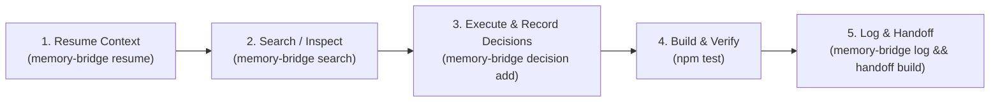

# 🧠 Engrene Memory Bridge (`engrene-memory-bridge`)

> **Um projeto. Uma memória. Qualquer agente de IA.**  
> Protocolo local-first, aberto e sem dependências de runtime para interoperabilidade contínua de memória entre agentes de código (Antigravity, Claude Code, Cursor, Copilot, Aider, Windsurf, Hermes, Gemini, Codex).

[](https://www.npmjs.com/package/engrene-memory-bridge)
[](LICENSE)
[](https://nodejs.org/)

---

## 🚀 Por que usar o Memory Bridge?

### 1. 💰 Economia Drástica de Tokens no Desenvolvimento Local
Em vez de queimar milhares de tokens da sua janela de contexto colando históricos gigantes, arquivos inteiros de log ou prompts redundantes:
- O Memory Bridge pré-filtra e injeta **apenas a informação necessária** através da busca híbrida (BM25 + Vetores Densos JEV).
- O arquivo consolidado [`handoff.md`](.memory-bridge/handoff.md) fornece um resumo de alto nível com tarefas pendentes e próximos passos sem estourar o limite de tokens.

### 2. 🌍 Continuidade Portátil & Acesso Remoto
Toda a memória do seu projeto reside na pasta local `.memory-bridge/` versionada diretamente pelo **Git**.
- **Desenvolveu local e precisa acessar de fora/remoto?** Basta dar um `git pull` na outra máquina ou servidor SSH.
- 100% da memória episódica, decisões técnicas e estado de progresso são transferidos instantaneamente entre qualquer IDE ou agente.

### 3. 🔓 Zero Lock-in e Zero Dependências de Runtime
- Roda **100% local e offline**, utilizando apenas recursos nativos do Node.js 20+ (`node:sqlite`, `node:crypto`, `node:fs`).
- Sem contêineres pesados, sem APIs pagas em nuvem, sem credenciais expostas.

---

## ⚡ Instalação Rápida

```bash
# Instalação global via npm
npm install -g engrene-memory-bridge

# Ou execução direta via npx
npx engrene-memory-bridge init
```

---

## 🧩 Integrações Nativas & Ecossistema

### 🔮 1. Sincronização com Obsidian Vault
Exporta a memória do repositório para o seu Vault do Obsidian, gerando notas em Markdown com YAML frontmatter e **wikilinks interconectados** (`[[dec-123]]`) para visualização no **Graph View**.

```bash
memory-bridge obsidian --vault ~/SeuObsidianVault
```

### ⚙️ 2. Compound Engineering (CE) Multi-Agente
Sincroniza automaticamente as decisões ativas e armadilhas do projeto entre as principais ferramentas de IA com um único comando:

```bash
memory-bridge ce
```
Este comando gera e atualiza instantaneamente:
- `AGENTS.md` (Instruções universais multi-agente)
- `.cursorrules` (Cursor IDE)
- `CLAUDE.md` (Claude Code / Anthropic CLI)
- `.github/copilot-instructions.md` (GitHub Copilot)

### 🔌 3. Servidor MCP (Model Context Protocol)
Suporte nativo ao protocolo MCP via stdio para Claude Desktop, Cursor, Windsurf e VS Code.

```bash
memory-bridge mcp
```
**Configuração `mcpServers`:**
```json
{
  "mcpServers": {
    "memory-bridge": {
      "command": "npx",
      "args": ["-y", "engrene-memory-bridge", "mcp"]
    }
  }
}
```

### 🛠️ 4. Skill Nativa para Antigravity & Gemini
Instale a skill nativa globalmente ou no workspace com:
```bash
memory-bridge install antigravity
```

---

## 🔄 Ciclo de Vida Padrão (Lifecycle Protocol)



1. **Início da Sessão**: Resgate o contexto ativo:
   ```bash
   memory-bridge resume --for antigravity
   ```
2. **Busca Híbrida (BM25 + Vetores JEV)**:
   ```bash
   memory-bridge search "como tratamos chaves de API" --mode hybrid
   ```
3. **Registro de Decisões**:
   ```bash
   memory-bridge decision add \
     --title "Arquitetura Local-First" \
     --decision "Adotar JSONL e SQLite nativo" \
     --context "Sem APIs pagas" \
     --impact "Total privacidade"
   ```
4. **Finalização da Sessão & Handoff**:
   ```bash
   memory-bridge log --tool antigravity --intent "Implementar recurso X" --summary "Criado módulo X e testes"
   memory-bridge handoff build
   ```

---

## 📋 Referência de Comandos CLI

| Comando | Descrição |
| :--- | :--- |
| `memory-bridge init` | Inicializa a estrutura `.memory-bridge/` no repositório. |
| `memory-bridge resume --for <tool>` | Resgata objetivos, pendências e decisões vigentes. |
| `memory-bridge search <query>` | Busca textual, semântica ou híbrida (BM25 + JEV). |
| `memory-bridge decision add` | Registra uma decisão técnica ou arquitetural durável. |
| `memory-bridge log` | Registra os eventos e artefatos de uma sessão concluída. |
| `memory-bridge handoff build` | Consolida o arquivo de passagem de bastão (`handoff.md`). |
| `memory-bridge obsidian` | Sincroniza e exporta memórias para um Vault do Obsidian. |
| `memory-bridge ce` | Sincroniza regras de Compound Engineering (`AGENTS.md`, `.cursorrules`, etc.). |
| `memory-bridge mcp` | Inicia o servidor MCP stdio. |
| `memory-bridge ui` | Abre a Dashboard Web Local (Porta 8787). |
| `memory-bridge doctor` | Diagnostica a integridade e saúde da memória. |

---

## 🛡️ Privacidade e Segurança
- **Redação Automática de Segredos**: Padrões de chaves de API, senhas e tokens JWT são expurgados antes da gravação.
- **Criptografia AES-256-GCM Opcional**: Encriptação local de envelope ativável via `config.json`.

---

## 📄 Licença
Licenciado sob a [MIT License](LICENSE). Desenvolvido pela comunidade **Engrene**.
