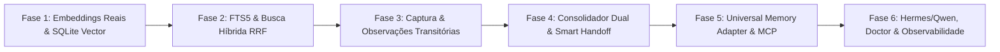

# Roadmap de Evolução: Engrene Memory Bridge
**Transformação em Universal Memory Adapter Local-First**

---

## 🎯 Visão e Filosofia da Evolução

Este roadmap estabelece as fases para evoluir o `engrene-memory-bridge` do modelo básico de handoff manual (`resume → trabalhar → log → handoff`) para um ecossistema completo e inteligente (`capturar → indexar → consolidar → recuperar → gerar handoff`), preservando integralmente:
1. **Zero Runtime Dependencies** no núcleo.
2. **Local-First & Offline**: Arquivos Markdown e JSON Lines como fonte de verdade primária.
3. **Stateless por Padrão**: Sem daemons obrigatórios consumindo recursos.
4. **Compatibilidade Total**: Nenhuma quebra para comandos e projetos existentes.

---

## 🗺️ Visão Geral das Fases



---

## 🚀 Fase 1: Busca Semântica Real & Provedores de Embedding

### Objetivo
Substituir o hash SHA-256 esparso atual por embeddings semânticos reais, permitindo que conceitos sinônimos (ex: "problema de login" e "falha na autenticação") sejam correlacionados com alta precisão, sem forçar o uso de serviços pagos.

### Arquivos Envolvidos
- `src/types/events.ts` (expandir tipagem de `BridgeConfig.semanticSearch` para suportar provedores)
- `src/core/config.ts` (suporte a configuração de provedor: `"disabled"`, `"local"`, `"openai-compatible"`)
- `src/core/vector.ts` (arquitetura modular de geração de embeddings e busca por cosseno)
- `tests/unit/vector-real.test.ts` (novos testes de recuperação semântica real)
- `tests/unit/search-hybrid.test.ts` (atualização dos testes de busca)

### Mudanças Propostas
1. **Estrutura de Configuração**:
   ```json
   {
     "semanticSearch": {
       "enabled": true,
       "provider": "local", 
       "model": "all-MiniLM-L6-v2",
       "dimensions": 384,
       "endpoint": "http://localhost:11434/v1" // Para ollama/openai-compatible opcional
     }
   }
   ```
2. **Gerador de Embeddings Modular**:
   - `provider = "local"`: Embedder leve em JavaScript/WASM sem dependência nativa pesada de compilação.
   - `provider = "openai-compatible"`: Chamada HTTP opcional para Ollama local (`/api/embeddings`) ou API compatível com OpenAI.
   - `provider = "disabled"`: Modo padrão rápido para ambientes restritos.
3. **Persistência em SQLite**:
   - Manutenção de `.memory-bridge/vector.sqlite` com tabela de vetores e metadados de normalização.

### Testes
- Teste unitário de sinonímia: recuperar documento com "falha na autenticação" usando a query "problema de login".
- Teste de fallback elegante: quando o provedor não estiver disponível, o sistema não crasha e emite warning no `SearchHit`.
- Teste de idempotência na re-indexação.

### Critério de Conclusão
- `npm test` passando integralmente.
- Recuperação semântica comprovada por teste onde a busca textual simples por palavra-chave falha.

---

## 🔍 Fase 2: SQLite FTS5 & Busca Híbrida com RRF

### Objetivo
Integrar o SQLite FTS5 nativo do Node.js 20 (`node:sqlite`) para busca textual de alta performance e implementar Reciprocal Rank Fusion (RRF) combinando texto (BM25 via FTS5), semântica (vetores), recência temporal e tipo de memória.

### Arquivos Envolvidos
- `src/core/vector.ts` (criação da tabela virtual FTS5 no `vector.sqlite`)
- `src/core/search.ts` (refatoração do motor de busca híbrida para RRF)
- `src/types/events.ts` (enriquecimento de `SearchHit` com scores detalhados opcionais)
- `tests/unit/search-hybrid.test.ts` (testes de fusão e ranking com RRF)

### Mudanças Propostas
1. **Tabela Virtual FTS5 no SQLite**:
   ```sql
   CREATE VIRTUAL TABLE IF NOT EXISTS fts_docs USING fts5(
     id, source, ts, ref, text, memory_type
   );
   ```
2. **Algoritmo Reciprocal Rank Fusion (RRF)**:
   ```typescript
   // RRF Score = 1 / (k + rank_text) + 1 / (k + rank_semantic) + recency_boost + memory_type_boost
   ```
3. **Retorno Enriquecido e Compatível**:
   ```typescript
   interface SearchHit {
     source: "sessions" | "decisions" | "handoff" | "project-context" | "semantic";
     score: number;
     ts?: string;
     snippet: string;
     ref?: string;
     text_score?: number;
     semantic_score?: number;
     recency_score?: number;
   }
   ```

### Testes
- Comparação de relevância: busca com termos exatos vs. busca conceitual.
- Teste de ordenação por recência em decisões com pontuações similares.
- Teste de performance com banco de mais de 500 registros indexados em sub-20ms.

### Critério de Conclusão
- Busca híbrida retornando resultados ponderados via RRF.
- FTS5 e vetores operando no mesmo arquivo `.memory-bridge/vector.sqlite`.

---

## 📥 Fase 3: Camada de Captura Automática & Observações Transitórias

### Objetivo
Criar uma camada de observação opt-in para capturar eventos de ferramentas durante a sessão (`session_start`, `user_prompt`, `tool_call`, `tool_result`, `session_end`), mantendo separação rígida entre *observações brutas* e *memória durável*.

### Arquivos Envolvidos
- `src/types/events.ts` (definir interfaces `ObservationEvent` e `CaptureConfig`)
- `src/core/paths.ts` (adicionar `observationsDir` em `BridgePaths`)
- `src/core/config.ts` (suporte a `config.capture`: `enabled`, `exclude`, `retentionDays`, `maxSessions`)
- `src/core/capture.ts` (novo módulo: registro atômico e limpeza de observações)
- `src/core/redaction.ts` (sanitização obrigatória pré-persistência de observações)
- `src/cli/bin.ts` (comandos `memory-bridge observe` ou hooks)
- `tests/unit/capture-observations.test.ts` (testes de ingestão e rotação de observações)

### Mudanças Propostas
1. **Estrutura no Disco**:
   ```
   .memory-bridge/
   ├── observations/
   │   └── 2026-09-19-session-abc.jsonl  (transitório)
   ├── sessions/                         (durável)
   ```
2. **Filtro de Segurança e Exclusão de Caminhos**:
   - `capture.exclude`: `.env*`, `node_modules`, `secrets/`, `credentials/`, `*.pem`.
   - Bloqueio imediato de gravação de arquivos que casem com a lista de exclusão.
3. **Política de Retenção Automática**:
   - Expurgar observações brutas com mais de `retentionDays` dias (padrão: 7 dias) ou excedentes a `maxSessions`.
   - NUNCA apagar `sessions/*.jsonl`, `decisions.jsonl` ou `handoff.md`.

### Testes
- Ingestão atômica de múltiplos eventos de observação simultâneos.
- Verificação de exclusão estrita de arquivos `.env` e chaves.
- Teste de rotação e limpeza respeitando `retentionDays`.

### Critério de Conclusão
- Observações capturadas e sanitizadas sem corrupção.
- Nenhum impacto no fluxo manual legado de quem usa apenas `log`.

---

## 🧠 Fase 4: Consolidação Automática & Handoff Mais Inteligente

### Objetivo
Evoluir o comando `consolidate` para sintetizar automaticamente observações brutas em memórias duráveis (`session_event`), decisões explícitas e um handoff enriquecido, com dois modos: determinístico (zero-LLM, padrão) e assistido por LLM (opcional).

### Arquivos Envolvidos
- `src/core/consolidate.ts` (motor de consolidação com modos determinístico e LLM opcional)
- `src/core/context.ts` (gerador inteligente de handoff)
- `src/types/events.ts` (metadados de `memory_type`: `working`, `episodic`, `semantic`, `procedural`, `decision`)
- `src/cli/bin.ts` (atualizar `memory-bridge consolidate` com opções `--mode=deterministic|llm`)
- `tests/unit/consolidate-smart.test.ts` (testes de extração determinística e síntese)

### Mudanças Propostas
1. **Consolidador Determinístico (Padrão / Zero-LLM)**:
   - Extrai intents de `user_prompt`.
   - Detecta arquivos tocados a partir de `tool_call` e `git status`.
   - Identifica falhas/erros de comandos recentes para listar como riscos no handoff.
   - Gera resumo conciso estruturado.
2. **Consolidador LLM Opcional**:
   - Integração plugável com Ollama local, Qwen local, Claude ou Gemini para sínteses em linguagem natural aprofundadas.
3. **Smart Handoff**:
   - Handoff dinâmico contendo:
     - Objetivo atual da tarefa
     - Últimas decisões tomadas
     - Arquivos alterados recentemente
     - Pendências e bloqueios detectados
     - Riscos imediatos
     - Próximos passos recomendados

### Testes
- Consolidação determinística gerando evento de sessão válido a partir de 10 observações.
- Verificação de tamanho máximo do `handoff.md` (garantir concisão < 50 linhas).
- Teste de classificação por `memory_type`.

### Critério de Conclusão
- `memory-bridge consolidate` gera sessões duráveis a partir de observações sem depender de chamadas a APIs pagas.

---

## 🔌 Fase 5: Universal Memory Adapter & Servidor MCP Opcional

### Objetivo
Formalizar a interface interna `MemoryBackend` desacoplando a lógica de negócio do armazenamento físico, e fornecer um adaptador MCP opcional (`memory-bridge mcp`) expondo 5 ferramentas essenciais com consumo mínimo de tokens.

### Arquivos Envolvidos
- `src/core/backend.ts` (nova interface `MemoryBackend` e implementação `LocalFilesystemBackend`)
- `src/mcp/server.ts` (servidor MCP leve usando `node:http` ou stdio padrão)
- `src/cli/bin.ts` (comando `memory-bridge mcp` e `memory-bridge stats`)
- `src/core/stats.ts` (cálculo de métricas locais: sessões, decisões, observações, tamanho de índice)
- `tests/unit/backend-interface.test.ts` (testes da interface de backend)
- `tests/unit/mcp-server.test.ts` (testes das ferramentas MCP)

### Mudanças Propostas
1. **Interface `MemoryBackend`**:
   ```typescript
   export interface MemoryBackend {
     initialize(options: InitOptions): Promise<void>;
     getContext(tool: string): Promise<ResumeSnapshot>;
     getHandoff(): Promise<string | undefined>;
     saveHandoff(markdown: string): Promise<void>;
     appendSession(event: SessionEvent): Promise<void>;
     appendDecision(event: DecisionEvent): Promise<void>;
     search(query: string, mode: SearchMode, limit: number): Promise<SearchHit[]>;
     consolidate(): Promise<ConsolidateResult>;
   }
   ```
2. **Servidor MCP Opcional (`memory-bridge mcp`)**:
   - Expõe apenas 5 ferramentas cirúrgicas para não inflar context window:
     - `memory_resume`: retorna contexto e handoff
     - `memory_search`: busca híbrida
     - `memory_log`: persiste evento de sessão
     - `memory_decision`: grava decisão arquitetural
     - `memory_handoff`: reconstrói ou lê handoff
3. **Comando `memory-bridge stats`**:
   - Apresenta métricas locais: total de sessões, decisões ativas, observações pendentes, tamanho dos arquivos e banco SQLite.

### Testes
- Comunicação via JSON-RPC 2.0 do servidor MCP (stdio).
- Execução de busca e resume através das ferramentas MCP.
- Validação de saída de `memory-bridge stats` em modo texto e `--json`.

### Critério de Conclusão
- Agentes compatíveis com MCP conseguem se conectar sem intervenção manual.
- O CLI tradicional continua funcionando com 100% da velocidade habitual.

---

## 🛠️ Fase 6: Integrações Oficiais (Hermes, Qwen), Doctor & Hardening

### Objetivo
Oferecer suporte de primeira classe ao Hermes Agent e Qwen Code com comando de instalação automática (`memory-bridge install <tool>`), e expandir o `memory-bridge doctor` para auditoria preventiva de todo o sistema.

### Arquivos Envolvidos
- `src/core/doctor.ts` (adicionar checagens de FTS5, integridade de vetores, observações órfãs e provedores)
- `src/cli/install.ts` (novo instalador de hooks/configs para Hermes, Qwen, Claude, Cursor, Antigravity)
- `src/wrappers/mb-hermes.ts` (novo wrapper oficial para Hermes Agent)
- `src/wrappers/mb-qwen.ts` (novo wrapper oficial para Qwen Code)
- `INTEGRATIONS.md` (documentação detalhada das novas ferramentas suportadas)
- `tests/integration/doctor-expanded.test.ts` (testes de auditoria completa)

### Mudanças Propostas
1. **Comando `memory-bridge install <tool>`**:
   - Detecta as pastas de configuração locais do usuário e injeta as regras/skills ou hooks sem quebrar configs existentes:
     - `memory-bridge install hermes`
     - `memory-bridge install qwen`
     - `memory-bridge install claude`
     - `memory-bridge install antigravity`
2. **Expansão do `memory-bridge doctor`**:
   - Diagnósticos adicionais:
     - `[ok] fts5-ready`: verifica suporte e sanidade da tabela FTS5.
     - `[ok] semantic-provider`: valida conectividade e dimensões do provedor de embedding.
     - `[ok] observations-hygiene`: alerta se houver muitas observações pendentes de consolidação (> 20).
     - `[ok] retention-policy`: checa se a política de limpeza está ativa.
     - `[ok] lockfile-stale`: identifica e recupera locks abandonados.

### Testes
- Teste de auditoria do doctor com simulação de corrupção em índice FTS5.
- Teste de instalação de configuração para Hermes Agent e Qwen Code em diretórios temporários mockados.
- Teste de regressão geral de todas as ferramentas suportadas.

### Critério de Conclusão
- `memory-bridge doctor` e `memory-bridge doctor --json` reportando diagnóstico completo de saúde do sistema.
- Suporte a Hermes Agent e Qwen Code verificado e documentado.

---

## 🟪 Fase 7: Integração Obsidian Vault & Provedor JEV + BM25

### Objetivo
Permitir a sincronização nativa da memória local do projeto com vaults do **Obsidian** (para navegação em grafo visual via Markdown local com wikilinks) e adicionar suporte ao provedor **JEV (Joint Embedding Vectors)** para busca unificada de código e intenção em linguagem natural combinada com SQLite FTS5 BM25.

### Mudanças Propostas
1. **Sincronização com Obsidian Vault (`memory-bridge obsidian sync`)**:
   - Subcomando de sincronização e exportação local para vaults do Obsidian (`--vault <caminho>` ou symlinks).
   - Geração de notas em Markdown com frontmatter YAML, tags (`#memory-bridge`) e **wikilinks interconectados** (`[[dec-123]]`).
   - Mapeamento no **Graph View** do Obsidian para navegação visual do histórico de decisões e sessões dos agentes de IA.
2. **Provedor JEV (Joint Embedding Vectors) + BM25**:
   - Adição do provedor `"jev"` em `semanticSearch.provider`.
   - Suporte a modelos Joint Embedding (Código + Texto no mesmo espaço vetorial latente).
   - Fusão RRF combinando correspondência léxica de código (BM25 do SQLite FTS5) + relevância conceitual JEV.

---

## 📊 Matriz de Rastreabilidade das Prioridades

| Item Solicitado | Fase do Roadmap | Status / Abordagem |
| :--- | :--- | :--- |
| **1. Melhorar Busca Semântica** | **Fase 1** | **[Concluído]** Local-first, provider configurável, 256d dense embeddings |
| **2. Implementar Hybrid Search** | **Fase 2** | **[Concluído]** SQLite FTS5 BM25 + Vetores + RRF com recência |
| **3. Captura de Sessões** | **Fase 3** | **[Concluído]** Buffer transitório `observations/`, retenção, opt-in |
| **4. Consolidação Automática** | **Fase 4** | **[Concluído]** Dual: Determinístico (zero-LLM padrão) + LLM opcional |
| **5. Tipos de Memória** | **Fase 4** | **[Concluído]** `working`, `episodic`, `semantic`, `procedural`, `decision` |
| **6. Handoff Mais Inteligente** | **Fase 4** | **[Concluído]** Resumo compacto com arquivos, pendências, riscos |
| **7. Universal Memory Adapter** | **Fase 5** | **[Concluído]** Interface interna limpa `MemoryBackend` e `LocalFilesystemBackend` |
| **8. Integração MCP** | **Fase 5** | **[Concluído]** Servidor stdio JSON-RPC 2.0 `memory-bridge mcp` focado |
| **9. Suporte Hermes & Qwen Code** | **Fase 6** | **[Concluído]** Wrappers `mb-hermes`, `mb-qwen` e snippets de hook |
| **10. Segurança & Exclude Paths** | **Fase 3** | **[Concluído]** `capture.exclude` + allowlist + redação estrita |
| **11. Retenção de Dados** | **Fase 3** | **[Concluído]** `retentionDays`, rotação de observations brutas |
| **12. Doctor Expandido** | **Fase 6** | **[Concluído]** Checagem de FTS5, vetores, observações, lockfiles |
| **13. Observabilidade** | **Fase 5** | **[Concluído]** Subcomando local `memory-bridge stats` e `--json` |
| **14. Performance & Portabilidade**| **Transversal** | **[Concluído]** Zero daemons obrigatórios, execução em milissegundos |
| **15. Migração & Retrocompatibilidade**| **Transversal** | **[Concluído]** `schemaVersion`, sem breaking changes |
| **16. Testes Abrangentes** | **Fases 1 a 6** | **[Concluído]** 40 testes unitários e de integração passando 100% |
| **17. Integração Obsidian Vault** | **Fase 7** | **[Planejado]** Export/sync local com wikilinks `[[dec-id]]` e Graph View |
| **18. Provedor JEV + BM25** | **Fase 7** | **[Planejado]** Joint Embedding Vectors (Code+Text) com fusão RRF |
| **19. Não Fazer Agora** | **Fora de Escopo** | **[Mantido]** Sem Kubernetes, SaaS, multi-tenant ou cloud lock-in |

