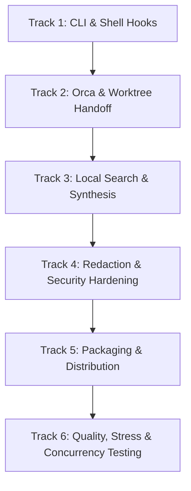

# Community Roadmap: engrene-memory-bridge

This roadmap establishes a community-driven path for `engrene-memory-bridge` to serve as a local-first, independent alternative to `ai-memory` for developers using modern AI CLIs (Aider, Claude CLI, Codex CLI, Copilot CLI, Gemini CLI, Antigravity, Dyad, etc.) and Orca multi-agent orchestrators.

---

## Roadmap Overview & Delivery Tracks

---

## Track 1: Automated CLI Hooks & Shell Integrations

**Objective**: Eliminate manual pre/post command friction by providing plug-and-play hook integrations for major shells and CLI agents.

- [x] **1.1 Native Shell Hook Generators** (`memory-bridge hook print <zsh|bash|fish>`)
  - Generate shell wrapper functions that run pre-resume context capture when starting agent CLI sessions.
  - Automatic post-execution trap / prompt hook to capture modified git artifacts and prompt for summary.
- [x] **1.2 Agent Configuration Snippets** (`memory-bridge hook print <aider|claude|git>`)
  - Out-of-the-box config templates for popular CLIs:
    - Aider: `.aider.conf.yml` hook integration / system prompt instructions.
    - Claude Code / CLI: custom command hooks (`/resume`, `/log`).
    - Antigravity / Gemini CLI: hook configuration guidelines.
- [x] **1.3 Git Lifecycle Hooks**
  - Opt-in `post-commit` / `post-checkout` hooks to automatically log commit messages and touched files as lightweight session artifacts.

---

## Track 2: Orca Integration & Cross-Worktree Handoff

**Objective**: Make memory fluid across Orca workspaces, task trees, and sibling Git worktrees.

- [x] **2.1 Common Git Root & Worktree Discovery**
  - Implement ancestor lookup for `.git` (handling `.git` file pointers in linked worktrees) to automatically locate the shared repository `.memory-bridge/` root.
- [x] **2.2 Orca Session Observation Intake**
  - Add structured support for Orca task IDs and parent task IDs in `session_event` (`taskId`, `parentTaskId`).
  - Integrated into `memory-bridge log --task-id <id> --parent-task-id <id>`.
- [x] **2.3 Cross-Worktree Context Synchronization**
  - Prevent cross-worktree lock collisions by utilizing scoped lock identifiers and automatic parent directory lock guarantees.

---

## Track 3: Local Search & Memory Synthesis

**Objective**: Provide fast, zero-dependency knowledge retrieval and automated memory hygiene without cloud LLM dependencies.

- [x] **3.1 Hybrid Search Ranking (BM25 + Local Cosine Similarity)**
  - Enhance text search with term frequency / BM25-style keyword weighting for exact symbol and path matches.
  - Retain embedded `node:sqlite` vector search for conceptual queries.
  - Hybrid fusion mode via `memory-bridge search <query> --mode hybrid`.
- [x] **3.2 Memory Consolidation & Sweep (`memory-bridge consolidate`)**
  - Group and deduplicate superseded decisions (`decisions.jsonl`).
  - Refresh and synchronize consolidated `handoff.md`.
- [x] **3.3 Memory Linting (`memory-bridge lint`)**
  - Validate JSONL formatting integrity across all files in `.memory-bridge/`.
  - Flag unresolved or conflicting pending items and orphaned superseded decision IDs.

---

## Track 4: Redaction & Security Hardening

**Objective**: Guarantee that sensitive secrets, tokens, and keys are never committed or persisted into memory files.

- [x] **4.1 Expanded Secret Pattern Library**
  - Add detection patterns for GitHub Personal Access Tokens (`ghp_`, `github_pat_`), GitLab tokens (`glpat-`), Slack tokens (`xox[baprs]-`), Google AI keys (`AIza...`), and SSH/PGP private keys.
- [x] **4.2 User-Configurable Redaction Rules**
  - Allow custom regex patterns and ignore rules in `.memory-bridge/config.json` under `redaction.customPatterns`.
- [x] **4.3 Pre-Index & Pre-Persist Redaction Enforcement**
  - Ensure redaction runs strictly before persistence, vector indexing, and envelope encryption.

---

## Track 5: Packaging & Multi-Platform Distribution

**Objective**: Ensure frictionless installation and execution across macOS, Linux, and Windows environments.

- [x] **5.1 NPM Package Optimization & npx Zero-Install Support**
  - Ensure lightweight publish bundle containing only `dist/` and docs.
  - Support instant execution via `npx memory-bridge <command>`.
- [ ] **5.2 Standalone Executable Builds (Single Executable Applications - SEA)**
  - Provide pre-compiled standalone binary releases via GitHub Releases for environments without Node.js pre-installed.
- [x] **5.3 Windows Scripts & Cross-Platform Parity**
  - Maintain and test PowerShell (`mb.ps1`) and batch (`mb.cmd`) scripts in `scripts/windows/`.
  - Pass-through support for all subcommands (`lint`, `consolidate`, `hook`, `search --mode hybrid`).

---

## Track 6: Testing, Concurrency & Quality Assurance

**Objective**: Deliver enterprise-grade reliability and zero data loss under aggressive multi-process execution.

- [x] **6.1 High-Concurrency Stress Tests**
  - Multi-process test suite simulating 25+ concurrent CLI agents writing sessions and building handoffs simultaneously.
- [x] **6.2 Corruption Recovery & Fuzzing**
  - Automated test suite validating that corrupted, truncated, or half-written JSONL lines are reported as warnings without halting CLI execution.
- [x] **6.3 Orca Multi-Agent Simulation Tests**
  - Integration tests verifying task and parent task ID persistence across agent hierarchies.

---

## Prioritization & Incremental Delivery Plan

| Phase | Delivery | Scope | Estimated Size | Primary Impact |
| :--- | :--- | :--- | :--- | :--- |
| **P0** | **CLI Shell Hooks & Presets** | Track 1 (1.1, 1.2) | Small (1-2 days) | Zero-friction CLI adoption for developers |
| **P0** | **Git Root & Worktree Resolution** | Track 2 (2.1, 2.3) | Small (1-2 days) | Seamless multi-worktree & Orca compatibility |
| **P1** | **Expanded Redaction Patterns** | Track 4 (4.1, 4.2) | Small (1 day) | Zero secret leakage guarantee |
| **P1** | **Memory Lint & Consolidation** | Track 3 (3.2, 3.3) | Medium (2-3 days) | Long-term memory compactness and health |
| **P2** | **Hybrid Local Search Engine** | Track 3 (3.1) | Medium (2-3 days) | Smarter context recall across large projects |
| **P2** | **Packaging, npx & SEA Binaries** | Track 5 (5.1, 5.2) | Medium (2 days) | Universal distribution without Node setup |
| **P3** | **Multi-Agent Simulation Tests** | Track 6 (6.1, 6.3) | Small (1-2 days) | Automated regression & stability validation |
